# Capítulo II: Requirements Elicitation & Analysis

## 2.1. Competidores

En el mercado de soluciones digitales para la gestión de citas, existen diversas plataformas que ofrecen funcionalidades similares a DeepLook. A continuación, se presentan los principales competidores identificados:

### 1) Fresha

Plataforma internacional orientada a negocios del sector belleza y bienestar, que permite gestionar reservas, clientes y horarios desde un entorno digital. Su modelo freemium facilita el acceso inicial, pero incluye cobros por funciones avanzadas y marketing, lo que incrementa el costo operativo a medida que el negocio crece.

### 2) Booksy

Plataforma de reservas que también funciona como marketplace, permitiendo a los negocios atraer nuevos clientes desde la misma aplicación. Su modelo se basa en suscripción mensual y pago por visibilidad, destacando por su capacidad de generación de demanda, aunque implica mayor competencia interna entre negocios.

### 3) Square Appointments

Solución que integra la gestión de citas con pagos electrónicos, orientada a negocios más formalizados. Su sistema ofrece una gestión completa del negocio, pero puede resultar menos accesible para microempresas debido a su complejidad y escalabilidad de costos.

---

## 2.1.1. Análisis competitivo

### COMPETITIVE ANALYSIS LANDSCAPE

**¿POR QUÉ LLEVAR A CABO ESTE ANÁLISIS?**

Llevar a cabo este análisis nos ayudará a comprender mejor en dónde estamos posicionados. Identificando nuestros principales diferenciadores, así como cosas que podemos mejorar o cambiar. De esta forma, establecer estrategias que agreguen valor a nuestro producto.

| **COMPETIDOR**               | **DeepLook**                                                                                                                                                               | **Fresha**                                                                                                    | **Booksy**                                                                                                            | **Square Appointments**                                                                                                           |
| ---------------------------- | -------------------------------------------------------------------------------------------------------------------------------------------------------------------------- | ------------------------------------------------------------------------------------------------------------- | --------------------------------------------------------------------------------------------------------------------- | --------------------------------------------------------------------------------------------------------------------------------- |
| **PERFIL**                   |                                                                                                                                                                            |                                                                                                               |                                                                                                                       |                                                                                                                                   |
| **OVERVIEW**                 | Plataforma para empresas emergentes que necesitan gestionar citas, promocionar servicios y ofrecer productos.                                                              | Plataforma internacional enfocada en reservaciones del sector de belleza, con herramientas básicas gratuitas. | Plataforma de reserva de citas, que a su vez funciona como marketplace                                                | Sistema que combina las reservas con pagos electrónicos y gestión financiera, orientado a negocios más formalizados.              |
| **VENTAJA COMPETITIVA**      | Integración de marketing, así como notificaciones todo a un bajo costo de entrada.                                                                                         | Sistema probado globalmente que ofrece distintos planes de suscripción.                                       | Sistema que ofrece una gran oportunidad para obtener clientes además de su marketplace.                               | Ofrece una integración financiera sólida, con una gestión completa de negocio desde la cita hasta el pago.                        |
| **PERFIL DE MARKETING**      |                                                                                                                                                                            |                                                                                                               |                                                                                                                       |                                                                                                                                   |
| **MERCADO OBJETIVO**         | Microempresas peruanas, negocios con gestión manual y emprendedores                                                                                                        | Negocios medianos globales del sector belleza y bienestar.                                                    | Negocios medianos/grandes en mercados urbanos con alta competencia                                                    | Negocios formales con mayor nivel de digitalización                                                                               |
| **ESTRATEGIAS DE MARKETING** | - Educación sobre la digitalización - Participación en eventos de emprendedores - Publicidad digital dentro de la plataforma - Captación directa (redes sociales) | - Su estrategia es mediante su modelo freemium, lo que facilita la entrada de nuevos negocios.                | - Se enfoca en su marketplace, además de que se enfoca en atraer clientes hacia los negocios dentro de la plataforma. | - Su marketing resalta la gestión completa del negocio mediante la integración de servicio, enfocado en negocios ya establecidos. |
| **PERFIL DE PRODUCTO**       |                                                                                                                                                                            |                                                                                                               |                                                                                                                       |                                                                                                                                   |
| **PRODUCTOS & SERVICIOS**    | - Agenda digital - Recordatorios - Perfil digital del negocio - Perfil                                                                                            | - Reservas - Gestión de clientes - Recordatorios                                                        | - Agenda - Marketplace - Descubrimiento de servicios - Promoción dentro de la app                            | - Agenda - Gestión de clientes - Pagos integrados                                                                           |
| **PRECIOS & COSTOS**         | - Suscripción mensual accesible - Modelo simple (sin costos ocultos)                                                                                                    | - Comisiones - Marketing pagado                                                                            | - Suscripción - Visibilidad premium                                                                                | - Suscripción escalable                                                                                                           |
| **CANALES DE DISTRIBUCIÓN**  | Web y Móvil                                                                                                                                                                | Web y Móvil                                                                                                   | Web y Móvil                                                                                                           | Web y Móvil                                                                                                                       |
| **ANÁLISIS SWOT**            |                                                                                                                                                                            |                                                                                                               |                                                                                                                       |                                                                                                                                   |
| **FORTALEZAS**               | Simplicidad, bajo costo y enfoque en múltiples nichos                                                                                                                      | Plataforma consolidada. Amplia base de usuarios                                                               | Alto tráfico de clientes potenciales.                                                                                 | Ecosistema financiero robusto.                                                                                                    |
| **DEBILIDADES**              | Sin marca posicionada, sin base de usuarios                                                                                                                                | No tiene presencial en Perú, cobro por nuevos clientes.                                                       | Alta competencia interna.                                                                                             | Menor accesibilidad a microempresas.                                                                                              |
| **OPORTUNIDADES**            | - Baja digitalización en Perú. - Crecimiento del mercado de microempresas - Expansión a múltiples sectores                                                           | - Expansión a mercados emergentes. - Diversificación de servicios                                          | - Crecimiento del mercado local - Integración con más sectores                                                     | - Mayor digitalización del sector formal - Integración con otros sistemas de pago                                              |
| **AMENAZAS**                 | - Entrada de competidores internacionales - Cambios en normativas de datos                                                                                              | - Saturación del mercado - Competidores locales más económicos                                             | - Nuevas plataformas con mejores comisiones - Cambios en hábitos de consumo                                        | - Plataformas de nicho más especializadas - Costos de mantener infraestructura                                                 |

---

## 2.1.2. Estrategias y tácticas frente a competidores

Basándonos en el análisis competitivo realizado, DeepLook implementará las siguientes estrategias y tácticas diferenciadas para posicionarse en el mercado peruano:

### 1. Estrategia de Diferenciación por Simplicidad y Accesibilidad

**Táctica:**

- Desarrollar una interfaz de usuario extremadamente intuitiva que no requiera curva de aprendizaje significativa
- Ofrecer onboarding guiado paso a paso con tutoriales interactivos en español peruano
- Implementar un modelo de precios transparente desde $20-100/mes sin costos ocultos ni comisiones por cliente nuevo

**Justificación:**  
Mientras Fresha cobra comisiones adicionales y Square Appointments tiene costos escal
ables complejos, DeepLook se posiciona como la alternativa transparente y asequible para microempresas que recién inician su digitalización.

---

### 2. Estrategia de Localización y Adaptación al Contexto Peruano

**Táctica:**

- Adaptar terminología, flujos y ejemplos al contexto local peruano
- Implementar soporte en español con casos de uso específicos de negocios peruanos (veterinarias, consultorios, emprendimientos digitales)
- Crear contenido educativo sobre digitalización dirigido a microempresarios peruanos

**Justificación:**  
A diferencia de Fresha (internacional sin presencia local) y Square (orientado a mercados formalizados), DeepLook se enfoca exclusivamente en las necesidades del mercado emergente peruano.

---

### 3. Estrategia de Integración Funcional sin Complejidad

**Táctica:**

- Unificar agenda + perfil digital + recordatorios + promoción en una sola plataforma simple
- Evitar el modelo marketplace de Booksy que genera competencia interna entre negocios
- Ofrecer funcionalidades completas desde el plan básico, sin escalar costos por funciones esenciales

**Justificación:**  
Mientras Booksy obliga a los negocios a competir dentro de su marketplace y Fresha monetiza funciones avanzadas por separado, DeepLook ofrece un ecosistema integrado sin fragmentación ni competencia forzada.

---

### 4. Estrategia de Educación y Acompañamiento Digital

**Táctica:**

- Crear un centro de ayuda con tutoriales paso a paso para tareas comunes
- Implementar tutorial interactivo de 5 pasos para nuevos usuarios
- Ofrecer guías rápidas ilustradas (2-4 minutos) para funciones clave
- Proveer FAQ contextualizado a problemas típicos de microempresas peruanas

**Justificación:**  
Los competidores asumen usuarios con experiencia digital previa. DeepLook reconoce que su segmento objetivo tiene baja digitalización y requiere acompañamiento educativo.

---

### 5. Estrategia de Marketing de Contenido y Captación Directa

**Táctica:**

- Publicar contenido educativo en redes sociales sobre "cómo digitalizar tu negocio de servicios"
- Participar en eventos y ferias de emprendedores locales
- Crear alianzas con incubadoras de negocios y asociaciones de microempresarios
- Implementar programa de referidos donde usuarios actuales invitan a otros emprendedores

**Justificación:**  
Mientras Fresha y Square dependen de presencia de marca internacional y Booksy de su marketplace, DeepLook construye tracción desde la base mediante educación y evangelización directa en el ecosistema emprendedor peruano.

---

### 6. Estrategia de Valor Agregado sin Costos Ocultos

**Táctica:**

- Ofrecer funcionalidades premium sin costo adicional: recordatorios automáticos, perfil digital, hasta 3 servicios destacados
- Transparencia total en modelo de precios: un solo plan mensual accesible
- Sin comisiones por cliente nuevo, sin cobros por volumen, sin penalización por crecimiento

**Justificación:**  
Fresha cobra por marketing y clientes nuevos, Booksy cobra por visibilidad premium, Square escala costos con el crecimiento. DeepLook apuesta por un modelo justo que incentiva el crecimiento del cliente sin penalizarlo económicamente.

---

### 7. Estrategia de Foco Multi-Nicho en Servicios por Cita

**Táctica:**

- Adaptar la plataforma para funcionar en múltiples sectores: veterinarias, consultorios, salones de belleza, talleres, etc.
- Crear plantillas y ejemplos específicos por sector
- Mantener la flexibilidad para que cualquier negocio de servicios por cita pueda adoptarla

**Justificación:**  
Fresha se limita al sector belleza, Square busca negocios formalizados, Booksy opera como marketplace cerrado. DeepLook se posiciona como la solución horizontal para CUALQUIER microempresa de servicios por cita en Perú.

---

### Resumen Estratégico:

| **Ventaja Competitiva** | **DeepLook**                      | **Competidores**                                                                                |
| ----------------------- | --------------------------------- | ----------------------------------------------------------------------------------------------- |
| **Precio**              | $20-100/mes transparente          | Fresha: comisiones variables Booksy: suscripción + visibilidad Square: escalable complejo |
| **Complejidad**         | Diseñado para baja digitalización | Asumen experiencia digital previa                                                               |
| **Localización**        | 100% adaptado a Perú              | Plataformas internacionales genéricas                                                           |
| **Modelo de Negocio**   | Sin comisiones ni costos ocultos  | Cobros adicionales por crecimiento/marketing                                                    |
| **Educación**           | Onboarding + tutoriales + soporte | Documentación técnica limitada                                                                  |
| **Versatilidad**        | Multi-sector (servicios por cita) | Enfocados en nichos específicos                                                                 |

Con estas estrategias, DeepLook busca capturar el mercado desatendido de microempresas peruanas que requieren digitalización simple, accesible y adaptada a su realidad operativa y económica.

---

## 2.2. Entrevistas

### 2.2.1. Diseño de entrevistas

    **Preguntas Segmento objetivo 1: Microempresas de servicios por citas:**

    - ¿Cuál es el nombre de su microempresa, qué servicios o productos ofrece?
    - ¿Qué herramientas utiliza para gestionar citas de clientes? ¿Cuánto paga mensualmente por ellas?
    - ¿Cuántos clientes aproximados recibe cada mes? ¿Cuál es el promedio de sus ganancias por cliente?
    - ¿Alguna vez ha perdido citas por falta de confirmación o errores de agenda?
    - ¿Cuál fue la estrategia para prevenir cometer más errores de este tipo?
    - ¿Cuáles fueron las estrategias para aumentar el alcance de clientes?
    - ¿Cuánto tiempo le tomó aprender las herramientas que utiliza actualmente para gestionar su negocio?
    - Si ahorrara 5 horas a la semana en gestión, ¿A qué actividad de ventas o servicios las dedicaría?

    **Preguntas Segmento objetivo 2: Emprendedores en proceso de digitalización**

    - ¿Cuál es el nombre de su emprendimiento, qué servicios o productos ofrece?
    - Actualmente, ¿Qué herramientas digitales utiliza para la gestión de su emprendimiento?
    - ¿Cuáles son las principales dificultades que enfrenta en cuanto a la gestión de productos?
    - ¿Cuántas conversiones calificadas (clientes que compraron) tiene al mes aproximadamente?
    - ¿Cuál es el rango de precios de sus productos?
    - ¿Cuáles son las principales dificultades que enfrenta en cuanto a posicionarse en el mercado?
    - ¿Cuáles fueron las estrategias para aumentar el alcance de clientes?
    - ¿Alguna vez ha perdido clientes por falta de confirmación o errores de agenda, con qué frecuencia?
    - ¿Estaría dispuesto a pagar un servicio que le asegure crecer su presencia digital?

---

### 2.2.2. Registro de entrevistas

| Campo          | Detalle                                                                                                                                                                                                                                                                                                                                                                                                                                                                                                                                                                                                                                                                                                                                                                                                                                                                                                                                                                                                                                                                                                                                             |
| :------------- | :-------------------------------------------------------------------------------------------------------------------------------------------------------------------------------------------------------------------------------------------------------------------------------------------------------------------------------------------------------------------------------------------------------------------------------------------------------------------------------------------------------------------------------------------------------------------------------------------------------------------------------------------------------------------------------------------------------------------------------------------------------------------------------------------------------------------------------------------------------------------------------------------------------------------------------------------------------------------------------------------------------------------------------------------------------------------------------------------------------------------------------------------------- |
| **Segmento**   | Microempresas de servicios por citas                                                                                                                                                                                                                                                                                                                                                                                                                                                                                                                                                                                                                                                                                                                                                                                                                                                                                                                                                                                                                                                                                                                |
| **Nombre**     | Manuel Mera                                                                                                                                                                                                                                                                                                                                                                                                                                                                                                                                                                                                                                                                                                                                                                                                                                                                                                                                                                                                                                                                                                                                         |
| **Edad**       | 45                                                                                                                                                                                                                                                                                                                                                                                                                                                                                                                                                                                                                                                                                                                                                                                                                                                                                                                                                                                                                                                                                                                                                  |
| **Distrito**   | San Borja                                                                                                                                                                                                                                                                                                                                                                                                                                                                                                                                                                                                                                                                                                                                                                                                                                                                                                                                                                                                                                                                                                                                           |
| **Screenshot** |                                                                                                                                                                                                                                                                                                                                                                                                                                                                                                                                                                                                                                                                                                                                                                                                                                                                                                                                                                                                                                                                                    |
| **URL**        | [Ver Video](https://upcedupe-my.sharepoint.com/:v:/g/personal/u202312510_upc_edu_pe/IQDBrZO9s2mAT7xto551_US-AfbpVrh4p76BzOYTsKC5xF4?nav=eyJyZWZlcnJhbEluZm8iOnsicmVmZXJyYWxBcHAiOiJPbmVEcml2ZUZvckJ1c2luZXNzIiwicmVmZXJyYWxBcHBQbGF0Zm9ybSI6IldlYiIsInJlZmVycmFsTW9kZSI6InZpZXciLCJyZWZlcnJhbFZpZXciOiJNeUZpbGVzTGlua0NvcHkifX0&e=SpU0eL)                                                                                                                                                                                                                                                                                                                                                                                                                                                                                                                                                                                                                                                                                                                                                                                                           |
| **Duración**   | 4:17                                                                                                                                                                                                                                                                                                                                                                                                                                                                                                                                                                                                                                                                                                                                                                                                                                                                                                                                                                                                                                                                                                                                                |
| **Resumen**    | En la entrevista Manuel, representante de la microempresa médica Vitalite (que atiende entre 150 y 200 pacientes al mes), proyecta una personalidad analítica y pragmática, interactuando de forma calmada. En sus respuestas, explica que gestiona su negocio sin costo utilizando tecnología y canales de interacción básicos e influenciados por ecosistemas de marcas tradicionales como Meta (WhatsApp para comunicación directa), Google (Calendar y Gmail, accesibles desde cualquier navegador web) y Microsoft (Excel), lo cual, al ser un ingreso de datos manual, le ha generado la pérdida de citas por errores de agenda o descuidos de los pacientes. Para solucionar esto, ha implementado una estrategia de doble verificación y capacitación constante, mientras intenta expandir su alcance apoyándose en el "boca a boca" y redes sociales; destacando que, si lograra optimizar este sistema y ahorrar cinco horas semanales, redirigiría ese esfuerzo hacia la promoción activa, la gestión de pagos y el control de inventario de medicamentos, evidenciando un perfil enfocado en la rentabilidad y la eficiencia operativa. |

| Campo          | Detalle                                                                                                                                                                                                                                                                                                                                                                                                                                                                                                                                                                                                                                                                                                                                                                                                                                                                                                                                |
| :------------- | :------------------------------------------------------------------------------------------------------------------------------------------------------------------------------------------------------------------------------------------------------------------------------------------------------------------------------------------------------------------------------------------------------------------------------------------------------------------------------------------------------------------------------------------------------------------------------------------------------------------------------------------------------------------------------------------------------------------------------------------------------------------------------------------------------------------------------------------------------------------------------------------------------------------------------------- |
| **Segmento**   | Microempresas de servicios por citas                                                                                                                                                                                                                                                                                                                                                                                                                                                                                                                                                                                                                                                                                                                                                                                                                                                                                                   |
| **Nombre**     | Isabel Patricia Carrera Peña                                                                                                                                                                                                                                                                                                                                                                                                                                                                                                                                                                                                                                                                                                                                                                                                                                                                                                           |
| **Edad**       | 60                                                                                                                                                                                                                                                                                                                                                                                                                                                                                                                                                                                                                                                                                                                                                                                                                                                                                                                                     |
| **Distrito**   | Lima                                                                                                                                                                                                                                                                                                                                                                                                                                                                                                                                                                                                                                                                                                                                                                                                                                                                                                                                   |
| **Screenshot** |                                                                                                                                                                                                                                                                                                                                                                                                                                                                                                                                                                                                                                                                                                                                                                                                                                                                       |
| **URL**        | [Ver Video](https://upcedupe-my.sharepoint.com/:v:/g/personal/u202419592_upc_edu_pe/IQCYXiDcGN4rRokYG7ta16UWAasVCvXPFTPANUqmbUNs7m4?e=1h0sKT)                                                                                                                                                                                                                                                                                                                                                                                                                                                                                                                                                                                                                                                                                                                                                                                          |
| **Duración**   | 3:40                                                                                                                                                                                                                                                                                                                                                                                                                                                                                                                                                                                                                                                                                                                                                                                                                                                                                                                                   |
| **Resumen**    | En la entrevista Isabel Carrera nos habla de su microempresa que es un estudio jurídico donde ofrece servicios de consulta legal. Menciona que actualmente sus clientes mensuales son aproximadamente 20, además menciona que su agenda la suele manejar por vía telefónica, física o por correo electrónico. Ella menciona que si ha perdido citas por su actual forma de agendar pero que simplemente optó por realizar más confirmaciones a las citas pre establecidas. Además también nos menciona que no le tomó mucho tiempo aprender sobre estas herramientas. Asimismo, nos explica que actualmente llega a más clientes mediante recomendación. Isabel también expresa que si tuviera más tiempo le gustaría hacer consultas a la comunidad de forma gratuita, para aquellos que no pueden costearse una. Por último menciona que uno de los aspectos más importantes para una aplicación de agenda serían los recordatorios. |

| Campo          | Detalle                                                                                                                                                                                                                                                                                                                                                                                                                                                                                                                                                                                                                                                                                                                                                                                                                                                                                                                                                                                                                                       |
| :------------- | :-------------------------------------------------------------------------------------------------------------------------------------------------------------------------------------------------------------------------------------------------------------------------------------------------------------------------------------------------------------------------------------------------------------------------------------------------------------------------------------------------------------------------------------------------------------------------------------------------------------------------------------------------------------------------------------------------------------------------------------------------------------------------------------------------------------------------------------------------------------------------------------------------------------------------------------------------------------------------------------------------------------------------------------------- |
| **Segmento**   | Emprendedores                                                                                                                                                                                                                                                                                                                                                                                                                                                                                                                                                                                                                                                                                                                                                                                                                                                                                                                                                                                                                                 |
| **Nombre**     | Angel Barrera                                                                                                                                                                                                                                                                                                                                                                                                                                                                                                                                                                                                                                                                                                                                                                                                                                                                                                                                                                                                                                 |
| **Edad**       | 23                                                                                                                                                                                                                                                                                                                                                                                                                                                                                                                                                                                                                                                                                                                                                                                                                                                                                                                                                                                                                                            |
| **Distrito**   | San Isidro                                                                                                                                                                                                                                                                                                                                                                                                                                                                                                                                                                                                                                                                                                                                                                                                                                                                                                                                                                                                                                    |
| **Screenshot** |                                                                                                                                                                                                                                                                                                                                                                                                                                                                                                                                                                                                                                                                                                                                                                                                                                                                                                                                                                              |
| **URL**        | [Ver Video](https://upcedupe-my.sharepoint.com/:v:/g/personal/u20201a277_upc_edu_pe/IQB3GJnQC5ElTLPmA1tJN30fARvVko-4ob-RL-t7mAVna54?nav=eyJyZWZlcnJhbEluZm8iOnsicmVmZXJyYWxBcHAiOiJPbmVEcml2ZUZvckJ1c2luZXNzIiwicmVmZXJyYWxBcHBQbGF0Zm9ybSI6IldlYiIsInJlZmVycmFsTW9kZSI6InZpZXciLCJyZWZlcnJhbFZpZXciOiJNeUZpbGVzTGlua0NvcHkifX0&e=MdPgw6)                                                                                                                                                                                                                                                                                                                                                                                                                                                                                                                                                                                                                                                                                                     |
| **Duración**   | 7:09                                                                                                                                                                                                                                                                                                                                                                                                                                                                                                                                                                                                                                                                                                                                                                                                                                                                                                                                                                                                                                          |
| **Resumen**    | En la entrevista Angel Barrera nos habla de su emprendimiento, el cual consiste en un servicio que dan a las personas que no quieren lidiar con la organización de sus viviendas alquiladas. Mencionó que no tienen estructurado la parte de dar información al cliente, que muchas veces tienen consultas. También dijo que actualmente tienen 20 clientes recurrentes nuevos cada mes, por lo tanto necesitan de una mejor organización porque su emprendimiento crece. Según el entrevistado, el problema con su posicionamiento en el mercado es la IA, debido a que las personas acuden a esta herramienta o internet. Las estrategias que han usado para su alcance de clientes es la publicidad a través de redes sociales como instagram. Angel menciona que ha perdido clientes debido a no contestar y atender a clientes por Whatsapp en la cantidad grande que ha tenido, por eso necesita estar mejor organizado. Finalmente menciona que digitalizarse sería el siguiente gran paso en su emprendimiento y que le gustaría eso. |

| Campo          | Detalle                                                                                                                                                                                                                                                                                                                                                                                                                                                                                                                                                                                                                                                                                                                                                                                                                                                                                                                                                                                                                                                                                                                                                                                                                                                                                                                                                                                                                                                                                                                                                                                                                                    |
| :------------- | :----------------------------------------------------------------------------------------------------------------------------------------------------------------------------------------------------------------------------------------------------------------------------------------------------------------------------------------------------------------------------------------------------------------------------------------------------------------------------------------------------------------------------------------------------------------------------------------------------------------------------------------------------------------------------------------------------------------------------------------------------------------------------------------------------------------------------------------------------------------------------------------------------------------------------------------------------------------------------------------------------------------------------------------------------------------------------------------------------------------------------------------------------------------------------------------------------------------------------------------------------------------------------------------------------------------------------------------------------------------------------------------------------------------------------------------------------------------------------------------------------------------------------------------------------------------------------------------------------------------------------------------- |
| **Segmento**   | Emprendedores                                                                                                                                                                                                                                                                                                                                                                                                                                                                                                                                                                                                                                                                                                                                                                                                                                                                                                                                                                                                                                                                                                                                                                                                                                                                                                                                                                                                                                                                                                                                                                                                                              |
| **Nombre**     | Jorge David Clentenes                                                                                                                                                                                                                                                                                                                                                                                                                                                                                                                                                                                                                                                                                                                                                                                                                                                                                                                                                                                                                                                                                                                                                                                                                                                                                                                                                                                                                                                                                                                                                                                                                      |
| **Edad**       | 24                                                                                                                                                                                                                                                                                                                                                                                                                                                                                                                                                                                                                                                                                                                                                                                                                                                                                                                                                                                                                                                                                                                                                                                                                                                                                                                                                                                                                                                                                                                                                                                                                                         |
| **Distrito**   | Piura                                                                                                                                                                                                                                                                                                                                                                                                                                                                                                                                                                                                                                                                                                                                                                                                                                                                                                                                                                                                                                                                                                                                                                                                                                                                                                                                                                                                                                                                                                                                                                                                                                      |
| **Screenshot** | 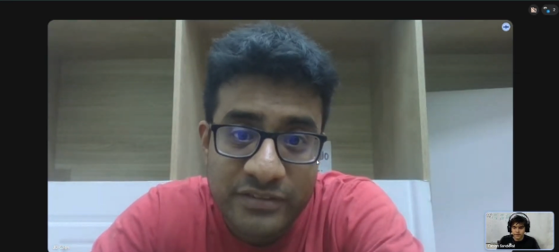                                                                                                                                                                                                                                                                                                                                                                                                                                                                                                                                                                                                                                                                                                                                                                                                                                                                                                                                                                                                                                                                                                                                                                                                                                                                                                                                                                                                                                                                                                                                                                          |
| **URL**        | [Ver Video](https://upcedupe-my.sharepoint.com/:v:/g/personal/u20221a132_upc_edu_pe/IQBUwy4yNr0IRJdGv2KvaP4IAcBxf9KVjQuxMf3xVnwgbQE?nav=eyJyZWZlcnJhbEluZm8iOnsicmVmZXJyYWxBcHAiOiJPbmVEcml2ZUZvckJ1c2luZXNzIiwicmVmZXJyYWxBcHBQbGF0Zm9ybSI6IldlYiIsInJlZmVycmFsTW9kZSI6InZpZXciLCJyZWZlcnJhbFZpZXciOiJNeUZpbGVzTGlua0NvcHkifX0&e=uanx06)                                                                                                                                                                                                                                                                                                                                                                                                                                                                                                                                                                                                                                                                                                                                                                                                                                                                                                                                                                                                                                                                                                                                                                                                                                                                                                  |
| **Duración**   | 9:48                                                                                                                                                                                                                                                                                                                                                                                                                                                                                                                                                                                                                                                                                                                                                                                                                                                                                                                                                                                                                                                                                                                                                                                                                                                                                                                                                                                                                                                                                                                                                                                                                                       |
| **Resumen**    | En la entrevista, Jorge David Centenas, representante del emprendimiento Incubic (producción de figuras artesanales con impresión 3D, enfocado en anime, personajes y llaveros personalizados), proyecta una personalidad emprendedora y orientada al crecimiento. Actualmente gestiona su negocio con herramientas básicas como Excel (finanzas, inventarios, clientes), Trello (organización) y software especializado de impresión 3D. Como equipo de 4 asesores, enfrenta desafíos operativos significativos: olvidos de pedidos, cruces de inventario y falta de información analítica sobre productos más vendidos. Con aproximadamente 2-3 clientes diarios y una tasa de conversión del 33% (40 prospectos mensuales vía redes sociales), el negocio maneja productos desde S/.5 (llaveros) hasta S/.150 (figuras personalizadas). Su principal ventaja competitiva es la escasa competencia en el norte del Perú con tecnología 3D, aunque enfrenta el reto de comunicar efectivamente su propuesta de valor. Ha implementado estrategias mixtas: ferias presenciales (mayor acogida), marketing orgánico en redes sociales, y publicidad pagada en Google Ads con resultados variables. Reporta una pérdida del 10-15% de conversiones actualmente (mejorada respecto al inicio), principalmente por temas de tiempo y calidad. Destaca su disposición a invertir hasta $20 mensuales en un servicio que garantice atención 24/7, personalización de recomendaciones de productos y reducción de pérdida de clientes en caliente, evidenciando un perfil proactivo hacia la profesionalización y digitalización de su operación. |

| Campo          | Detalle                                                                                                                                                                                                                                                                                                                                                                                                                                                                                                                                                                                                                                                                                                                                                     |
| :------------- | :---------------------------------------------------------------------------------------------------------------------------------------------------------------------------------------------------------------------------------------------------------------------------------------------------------------------------------------------------------------------------------------------------------------------------------------------------------------------------------------------------------------------------------------------------------------------------------------------------------------------------------------------------------------------------------------------------------------------------------------------------------- |
| **Segmento**   | Emprendedores                                                                                                                                                                                                                                                                                                                                                                                                                                                                                                                                                                                                                                                                                                                                               |
| **Nombre**     | Rut Camacho                                                                                                                                                                                                                                                                                                                                                                                                                                                                                                                                                                                                                                                                                                                                                 |
| **Edad**       | 28                                                                                                                                                                                                                                                                                                                                                                                                                                                                                                                                                                                                                                                                                                                                                          |
| **Distrito**   | San Borja                                                                                                                                                                                                                                                                                                                                                                                                                                                                                                                                                                                                                                                                                                                                                   |
| **Screenshot** | 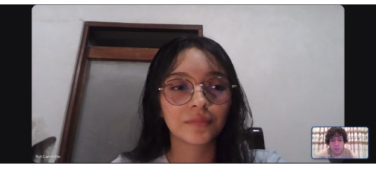                                                                                                                                                                                                                                                                                                                                                                                                                                                                                                                                                                                                                                                                                           |
| **URL**        | [Ver Video](https://upcedupe-my.sharepoint.com/:v:/g/personal/u20201a277_upc_edu_pe/IQB0rbBKPGblTY8P687v1ee4AffVocjm5Izwm6gaQujAr4M?nav=eyJyZWZlcnJhbEluZm8iOnsicmVmZXJyYWxBcHAiOiJPbmVEcml2ZUZvckJ1c2luZXNzIiwicmVmZXJyYWxBcHBQbGF0Zm9ybSI6IldlYiIsInJlZmVycmFsTW9kZSI6InZpZXciLCJyZWZlcnJhbFZpZXciOiJNeUZpbGVzTGlua0NvcHkifX0&e=OJPHDg)                                                                                                                                                                                                                                                                                                                                                                                                                   |
| **Duración**   | 6:10                                                                                                                                                                                                                                                                                                                                                                                                                                                                                                                                                                                                                                                                                                                                                        |
| **Resumen**    | En esta entrevista, la entrevistada llamada Rut Camacho comentó que su negocio Glow Studio, es una peluquería y estudio de maquillaje para mujeres. Mencionó que trabaja junto con una socia y ofrecen peinados, cortes, tratamientos capilares y maquillaje para eventos. Actualmente gestionan sus citas usando WhatsApp e Instagramr. Sin embargo, indicó que todavía manejan muchas cosas de forma manual. También dijo que reciben entre 80 y 120 clientas al mes. Señaló que a veces pierden citas por falta de confirmación o cruces de horarios. Y a veces ha pasado que dan un adelante y luego no van. Finalmente, explicó que si le gustaría tener una plataforma que le ayude a organizar todo esto, y mencionó que definitivamente si pagaría. |

| Campo          | Detalle                                                                                                                                                                                                                                                                                                                                                                                                                                                                                                                                                                                                                                                                                                                                                                                                                                                                                                                                                                                                                                                                                                                                                                                                                                                                                                                                                                                                                                                                                          |
| :------------- | :----------------------------------------------------------------------------------------------------------------------------------------------------------------------------------------------------------------------------------------------------------------------------------------------------------------------------------------------------------------------------------------------------------------------------------------------------------------------------------------------------------------------------------------------------------------------------------------------------------------------------------------------------------------------------------------------------------------------------------------------------------------------------------------------------------------------------------------------------------------------------------------------------------------------------------------------------------------------------------------------------------------------------------------------------------------------------------------------------------------------------------------------------------------------------------------------------------------------------------------------------------------------------------------------------------------------------------------------------------------------------------------------------------------------------------------------------------------------------------------------- |
| **Segmento**   | Emprendedor                                                                                                                                                                                                                                                                                                                                                                                                                                                                                                                                                                                                                                                                                                                                                                                                                                                                                                                                                                                                                                                                                                                                                                                                                                                                                                                                                                                                                                                                                      |
| **Nombre**     | Arturo Ruiz - Representante legal de Global Salva SAC                                                                                                                                                                                                                                                                                                                                                                                                                                                                                                                                                                                                                                                                                                                                                                                                                                                                                                                                                                                                                                                                                                                                                                                                                                                                                                                                                                                                                                            |
| **Edad**       | 32                                                                                                                                                                                                                                                                                                                                                                                                                                                                                                                                                                                                                                                                                                                                                                                                                                                                                                                                                                                                                                                                                                                                                                                                                                                                                                                                                                                                                                                                                               |
| **Distrito**   | Tarapoto                                                                                                                                                                                                                                                                                                                                                                                                                                                                                                                                                                                                                                                                                                                                                                                                                                                                                                                                                                                                                                                                                                                                                                                                                                                                                                                                                                                                                                                                                         |
| **Screenshot** |                                                                                                                                                                                                                                                                                                                                                                                                                                                                                                                                                                                                                                                                                                                                                                                                                                                                                                                                                                                                                                                                                                                                                                                                                                                                                                                                                                                                                            |
| **URL**        | [Escuchar Audio](https://upcedupe-my.sharepoint.com/:v:/g/personal/u20221a132_upc_edu_pe/IQBsQY0Lq394T7qHWbhUNHvnAbJTBSEZW1ZONXpcD0Vt2PA?nav=eyJyZWZlcnJhbEluZm8iOnsicmVmZXJyYWxBcHAiOiJPbmVEcml2ZUZvckJ1c2luZXNzIiwicmVmZXJyYWxBcHBQbGF0Zm9ybSI6IldlYiIsInJlZmVycmFsTW9kZSI6InZpZXciLCJyZWZlcnJhbFZpZXciOiJNeUZpbGVzTGlua0NvcHkifX0&e=1MDD8K)                                                                                                                                                                                                                                                                                                                                                                                                                                                                                                                                                                                                                                                                                                                                                                                                                                                                                                                                                                                                                                                                                                                                                   |
| **Duración**   | 2:35                                                                                                                                                                                                                                                                                                                                                                                                                                                                                                                                                                                                                                                                                                                                                                                                                                                                                                                                                                                                                                                                                                                                                                                                                                                                                                                                                                                                                                                                                             |
| **Resumen**    | En la entrevista, el representante de Global Salva (microempresa de ecommerce especializada en productos en tendencia), muestra un perfil emprendedor con mayor madurez digital comparado con otros segmentos. Actualmente utiliza WhatsApp API integrado con Lucid Bot, invirtiendo entre $80-$100 mensuales en automatización de atención al cliente. Su operación maneja volúmenes significativos: 2,000-3,000 prospectos mensuales con una conversión aproximada del 33-50%, manteniendo márgenes de ganancia entre 20-30% por transacción. A diferencia de negocios de servicios por cita, su modelo de venta rápida de productos no requiere agendamiento, sin embargo, identifica como principal pain point la pérdida de oportunidades por demora en respuesta, problema que abordó migrando desde WhatsApp Business básico hacia soluciones más robustas con API y bot. Su estrategia de adquisición se basa en inversión publicitaria dual: Meta Ads y TikTok Ads, diversificando canales para maximizar alcance. Demuestra conciencia sobre la curva de aprendizaje tecnológico y reconoce que el aprendizaje digital es un proceso continuo. Si optimizara 5 horas semanales, las redirigiría hacia coordinación interna del equipo, evidenciando que su cuello de botella ya no es la atención al cliente (automatizada) sino la gestión operativa interna. Este perfil representa un emprendedor que ya superó la digitalización básica y busca optimización avanzada de procesos. |

---

### 2.2.3. Análisis de entrevistas

    **Análisis de Entrevista sobre Segmento 1: Microempresas de servicios por citas**

|                  Entrevistado                   | Análisis                                                                                                                                                                                                                                                                                                                                                                                                                                                  |
| :---------------------------------------------: | :-------------------------------------------------------------------------------------------------------------------------------------------------------------------------------------------------------------------------------------------------------------------------------------------------------------------------------------------------------------------------------------------------------------------------------------------------------- |
|             Manuel Mera (Vitalite)              | Utiliza herramientas gratuitas básicas (WhatsApp, Google Calendar, Excel) para gestionar 150-200 pacientes mensuales. Ha perdido citas por errores manuales, implementando doble verificación como solución. Destaca la necesidad de recordatorios automáticos y optimización de tiempo para redirigir esfuerzos hacia promoción, pagos e inventario. Perfil pragmático enfocado en rentabilidad y eficiencia operativa sin inversión tecnológica actual. |
| Isabel Patricia Carrera Peña (Estudio Jurídico) | Gestiona aproximadamente 20 clientes mensuales mediante agenda telefónica, física y correo electrónico. Ha perdido citas ocasionalmente, solucionándolo con más confirmaciones manuales. Valora principalmente los recordatorios en una aplicación de agenda. Desea utilizar tiempo ahorrado para ofrecer consultas gratuitas a la comunidad. Perfil orientado al servicio con gestión tradicional.                                                       |
|         Arturo Ruiz (Global Salva SAC)          | Empresario con digitalización avanzada. Utiliza WhatsApp API + Lucid Bot ($80-$100/mes). Maneja 2,000-3,000 prospectos mensuales con conversión del 33-50% (1,000 clientes). Márgenes 20-30%. No maneja citas (ecommerce de productos en tendencia). Pain point: demora en respuesta y coordinación interna. Invierte en Meta Ads + TikTok Ads. Representa segmento más maduro digitalmente, fuera del target inicial de Impulso360.                      |

    **Análisis de Entrevista sobre Segmento 2: Emprendedores en proceso de digitalización**

| Entrevistado | Análisis |
| :----------: | :------- |

|Angel Barrera
(Gestión de viviendas alquiladas)|Emprendimiento en crecimiento (20 clientes recurrentes/mes). No tiene estructurada la atención al cliente ni gestión de consultas. Principal problema: desorganización al escalar. Pérdida de clientes por no atender WhatsApp a tiempo. Competencia: IA e internet. Estrategia: Instagram orgánico. Disposición clara a digitalizarse. Necesita CRM básico y mejor organización operativa.|
|Jorge David Centenas (Incubic)|Producción de figuras 3D artesanales (anime, personajes, llaveros). Equipo de 4 asesores. Herramientas: Excel, Trello, software 3D. Pain points: olvidos de pedidos, cruces de inventario, falta de analytics. 2-3 clientes/día, 33% conversión, 40 prospectos/mes vía redes. Productos S/.5-S/.150. Ventaja: poca competencia en norte de Perú (tecnología 3D). Reto: comunicar propuesta de valor. Estrategia: ferias presenciales + marketing orgánico + Google Ads. Pérdida actual: 10-15%. Disposición: $20/mes por atención 24/7 y personalización.|

---

## 2.3. Needfinding

### 2.3.1. User Personas

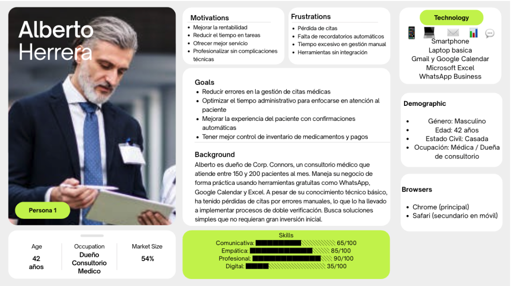

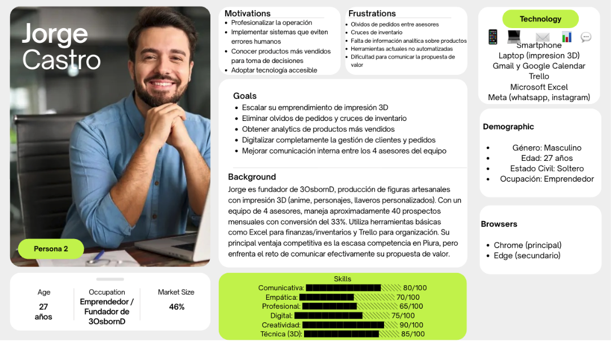

---

### 2.3.2. User Task Matrix

En esta fase, nos centraremos en las actividades que los User Persona del segmento objetivo de Microempresas de servicios por citas desean llevar a cabo en la aplicación, personificado por Manuel Mera. Del mismo modo, consideraremos las necesidades del segundo User Persona del segmento de Emprendedores en proceso de digitalización, personificado por Jorge David Centenas. A continuación, detallamos las actividades que ambos realizan para lograr sus objetivos.

### Segmento Objetivo 1: Manuel Mera

| Actividades                                                   | Frecuencia     | Importancia |
| ------------------------------------------------------------- | -------------- | ----------- |
| Registrar citas de pacientes en agenda digital                | Diariamente    | Alta        |
| Confirmar citas próximas con pacientes vía WhatsApp o llamada | Con Frecuencia | Alta        |
| Revisar agenda del día para organizar atenciones médicas      | Diariamente    | Alta        |
| Actualizar historial de pacientes con notas de consulta       | Con Frecuencia | Media       |
| Recibir recordatorios automáticos de citas próximas           | Diariamente    | Alta        |
| Reprogramar citas canceladas o modificadas por pacientes      | Con Frecuencia | Alta        |
| Consultar información de pacientes recurrentes                | A veces        | Media       |
| Generar reportes de citas atendidas mensualmente              | Mensualmente   | Media       |
| Controlar inventario de medicamentos del consultorio          | Semanalmente   | Media       |
| Gestionar pagos de consultas y servicios médicos              | Con Frecuencia | Alta        |

---

### Segmento Objetivo 2: Jorge David Centenas

| Actividades                                                         | Frecuencia     | Importancia |
| ------------------------------------------------------------------- | -------------- | ----------- |
| Registrar pedidos de clientes con detalles del producto 3D          | Diariamente    | Alta        |
| Coordinar con equipo de asesores sobre pedidos pendientes           | Diariamente    | Alta        |
| Actualizar inventario de productos terminados y materiales          | Con Frecuencia | Alta        |
| Recibir notificaciones de nuevos prospectos en redes sociales       | Diariamente    | Alta        |
| Consultar analytics de productos más vendidos                       | Semanalmente   | Alta        |
| Gestionar historial de clientes recurrentes                         | A veces        | Media       |
| Compartir catálogo digital de productos personalizados con clientes | Con Frecuencia | Alta        |
| Confirmar pedidos y fechas de entrega con clientes                  | Con Frecuencia | Alta        |
| Acceder a perfil digital del negocio para actualizar servicios      | A veces        | Media       |
| Generar reportes de ventas y conversiones mensuales                 | Mensualmente   | Media       |
| Resolver cruces de información entre asesores del equipo            | Con Frecuencia | Alta        |
| Promocionar productos destacados en perfil digital                  | Semanalmente   | Media       |

### 2.3.3. User Journey Mapping

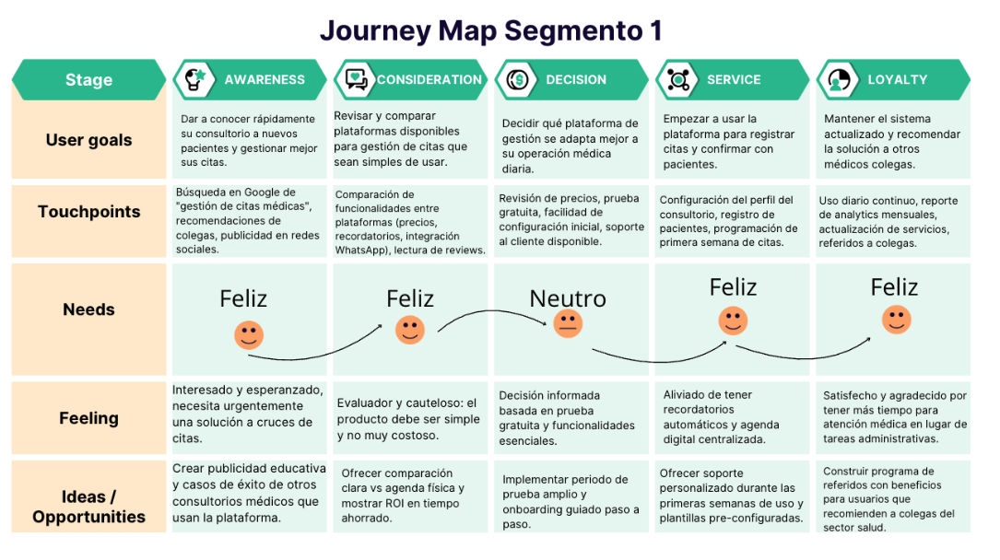

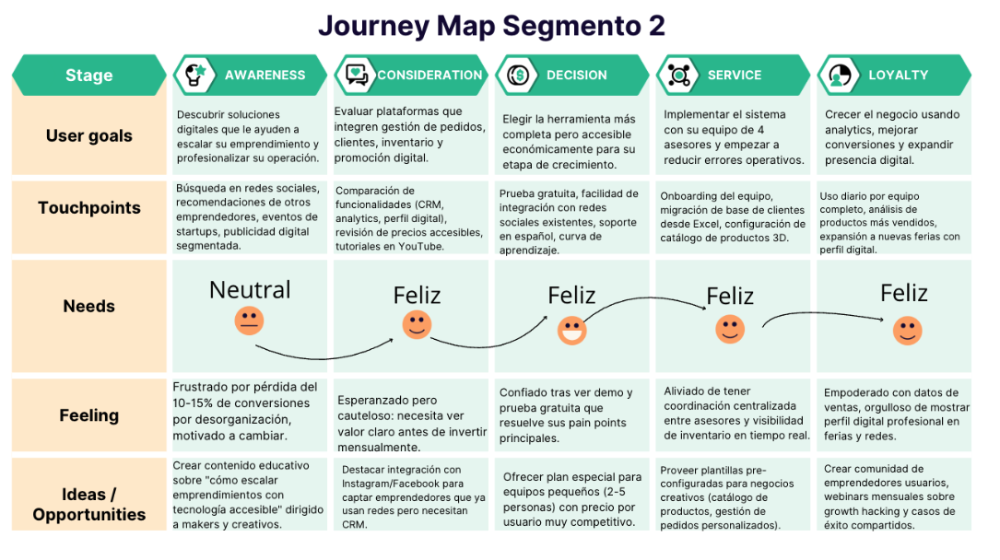

---

### 2.3.4. Empathy Mapping

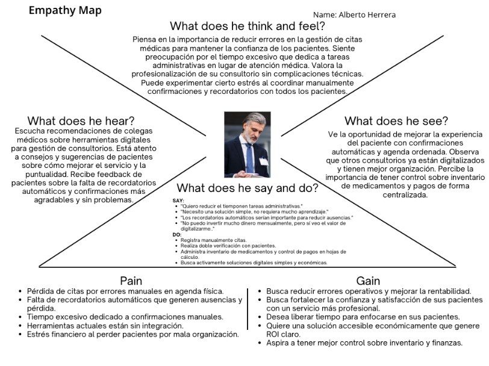

## 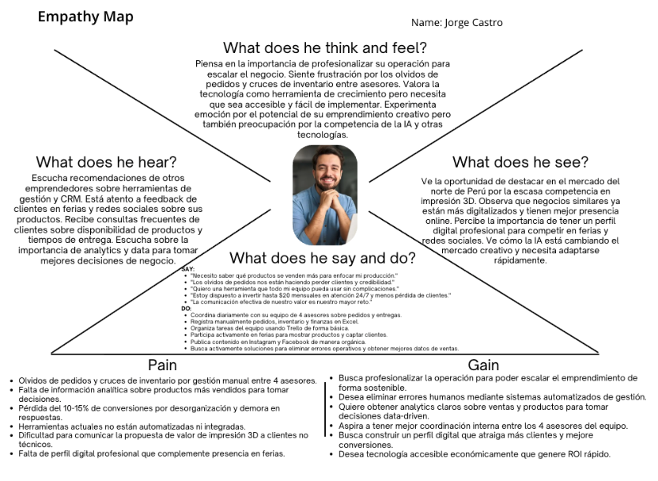

---

## 2.4. Big Picture Event Storming

## 2.4. Big Picture Event Storming

En esta sección se detalla el proceso de exploración del dominio del negocio de DeepLook mediante la metodología de Event Storming. El objetivo de esta sesión fue capturar de forma visual y cronológica los eventos significativos que ocurren en nuestro ecosistema, permitiendo al equipo identificar procesos críticos, cuellos de botella y oportunidades de mejora antes de la implementación técnica.

### Resumen del Proceso

El equipo realizó una sesión de lluvia de ideas enfocada en "eventos de dominio" (cosas que han sucedido y que son importantes para el negocio). Utilizamos una línea de tiempo horizontal para organizar estos eventos desde la prospección del cliente hasta la entrega de valor final.

1. **Exploración de Eventos:** Identificamos todos los hitos relevantes expresados en tiempo pasado (ej. "Usuario registrado", "Datos analizados").

2. **Identificación de Pivotes y Comandos:** Agrupamos los eventos por contextos y definimos qué acciones (comandos) los disparan.

3. **Detección de "Hot Spots":** Señalamos áreas de incertidumbre o posibles fallos en el flujo de datos.

---

### Capturas y Explicaciones de las Etapas

**Etapa 1: Unordered Events (Lluvia de Eventos)**  
En esta fase inicial, el equipo lanzó todos los eventos posibles sin un orden estricto para no limitar la visión del negocio.

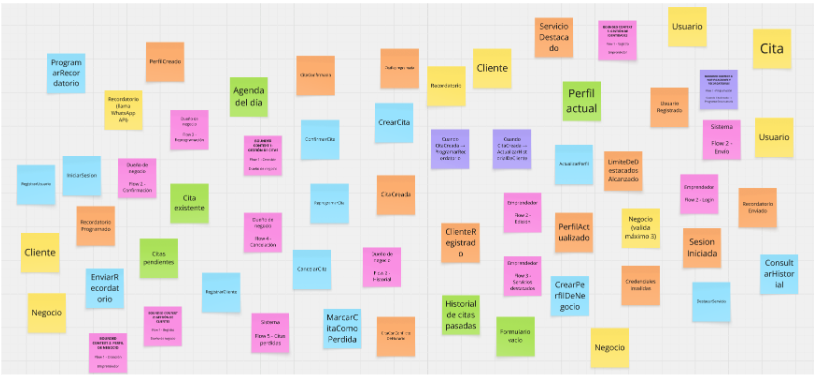

**Etapa 2: Timeline Enforcement (Orden Cronológico)**  
Ordenamos los eventos de izquierda a derecha. Aquí identificamos el flujo principal: desde que el usuario visita la Landing Page, se registra, conecta sus fuentes de datos, hasta que el sistema genera las visualizaciones.

**Etapa 3: Identificación de Contextos (Bounded Contexts)**  
Agrupamos los eventos en áreas específicas. En DeepLook, identificamos tres contextos principales:

- **Gestión de Usuario:** Registro, Login y Configuración de perfil.
- **Procesamiento de Datos:** Recepción de información cruda y ejecución de algoritmos de análisis.
- **Visualización y Reporting:** Generación de gráficos y exportación de documentos.

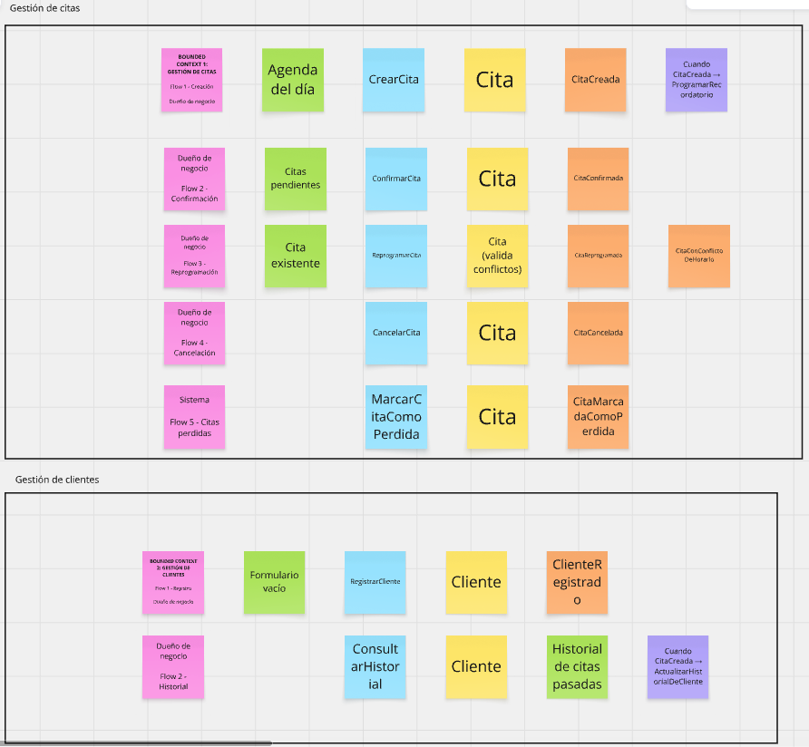

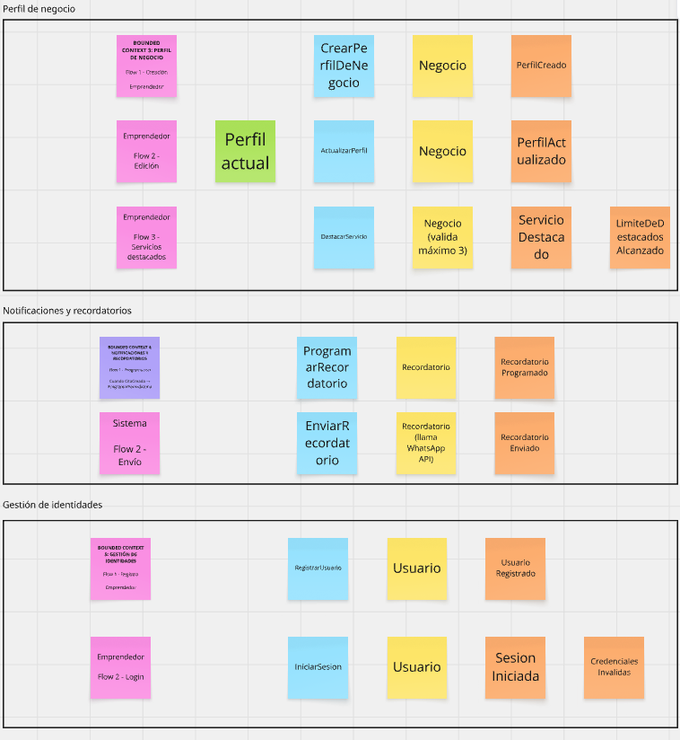

---

### Hallazgos y Oportunidades

Tras la culminación de las etapas del Big Picture Event Storming, el equipo de DeepLook realizó un análisis crítico del mapa resultante para identificar puntos de fricción y áreas de alto valor estratégico.

Los hallazgos principales se detallan a continuación:

- **Identificación de "Hot Spots" (Áreas Críticas):** Gracias a la utilización de marcas rojas en la sesión, detectamos que el proceso de conexión de fuentes de datos externas y la validación de formatos de archivo representan los mayores riesgos técnicos. El equipo determinó que se requiere una interfaz de carga extremadamente intuitiva para evitar que el usuario abandone la plataforma en los primeros pasos.

- **Optimización del Flujo de Usuario:** Se identificó que el comando "Generar Reporte" es el evento disparador de mayor valor para el cliente. En respuesta, se decidió simplificar los pasos intermedios, automatizando la selección de métricas sugeridas según el tipo de negocio, lo que reduce el tiempo desde el registro hasta la obtención de resultados.

- **Estructuración de Microservicios:** El mapeo visual permitió delimitar claramente los contextos de Gestión de Clientes y Motor de Analítica. Esto facilita una arquitectura de software más limpia, donde el procesamiento de grandes volúmenes de datos no afecte la velocidad de navegación en el resto de la aplicación.

- **Oportunidades de Valor Agregado:** Se observó una oportunidad tras el evento "Reporte Visualizado". El equipo integrará una función de "Compartir mediante enlace seguro", permitiendo que los analistas colaboren con otros departamentos de la empresa de manera inmediata, aumentando así la retención de usuarios.

---

## 2.5. Ubiquitous Language

## 2.5. Ubiquitous Language

Este glosario contiene los términos y conceptos clave del dominio de negocio de **DeepLook - Impulso360**, una plataforma de gestión de citas para microempresas de servicios en Perú. Estos términos son utilizados de manera consistente por todos los miembros del equipo y stakeholders para garantizar una comunicación clara y sin ambigüedades.

---

### A

**Appointment (Cita)**  
Reserva programada entre un cliente y un negocio de servicios para recibir atención en una fecha y hora específica. Incluye información sobre el cliente, servicio solicitado, duración estimada y estado (confirmada, pendiente, cancelada).

**Appointment Cancellation (Cancelación de Cita)**  
Acción de anular una cita previamente registrada, liberando el horario para nuevas reservas y actualizando el estado de la cita a "cancelada".

**Appointment Confirmation (Confirmación de Cita)**  
Proceso mediante el cual el negocio o el cliente verifica que la cita se llevará a cabo en la fecha y hora acordadas, cambiando el estado de la cita de "pendiente" a "confirmada".

**Appointment History (Historial de Citas)**  
Registro cronológico de todas las citas pasadas asociadas a un cliente específico, incluyendo servicios recibidos, fechas y notas relevantes.

**Appointment Reminder (Recordatorio de Cita)**  
Notificación automática enviada al negocio o cliente antes de una cita programada para reducir olvidos y ausencias.

**Appointment Rescheduling (Reprogramación de Cita)**  
Modificación de la fecha u hora de una cita existente sin perder el registro del cliente y servicio asociado.

**Appointment Status (Estado de Cita)**  
Clasificación del estado actual de una cita: Confirmada (verificada por ambas partes), Pendiente (registrada pero sin confirmar), o Cancelada (anulada).

---

### B

**Business Owner (Dueño de Negocio)**  
Persona responsable de la administración y operación de una microempresa de servicios que utiliza Impulso360 para gestionar sus citas y clientes.

**Business Profile (Perfil de Negocio)**  
Información pública del negocio visible digitalmente, incluyendo nombre, descripción, categoría, servicios ofrecidos, horarios de atención, datos de contacto e imagen de portada.

---

### C

**Client (Cliente)**  
Persona que solicita o recibe servicios de un negocio. En Impulso360, cada cliente tiene un registro con información de contacto, historial de citas y estado (activo/inactivo).

**Client Database (Base de Clientes)**  
Conjunto organizado de registros de clientes almacenados en la plataforma, permitiendo consulta, búsqueda y seguimiento de su historial de interacciones con el negocio.

**Client Status (Estado de Cliente)**  
Clasificación del cliente como Activo (con citas recientes o frecuentes) o Inactivo (sin interacciones recientes con el negocio).

**Confirmation (Confirmación)**  
Verificación explícita de que una cita programada se llevará a cabo según lo planeado.

---

### D

**Daily Agenda (Agenda del Día)**  
Vista de todas las citas programadas para la fecha actual, organizada cronológicamente para facilitar la planificación de la jornada laboral.

**Daily Panel (Panel Diario)**  
Resumen visual del estado operativo del negocio en el día actual, mostrando métricas como citas confirmadas, pendientes, clientes atendidos y recordatorios activos.

**Digital Presence (Presencia Digital)**  
Visibilidad del negocio en medios digitales a través del perfil público de Impulso360, permitiendo mostrar servicios, información de contacto y facilitar reservas.

**Digitalization (Digitalización)**  
Proceso de transición desde métodos manuales (agendas físicas, mensajes informales) hacia el uso de herramientas digitales para gestionar operaciones del negocio.

---

### E

**Emerging Business (Empresa Emergente)**  
Microempresa o negocio de servicios en etapa inicial de operación o en proceso de formalización y digitalización.

**Entrepreneur (Emprendedor)**  
Persona que inicia y gestiona un negocio propio, típicamente con recursos limitados y en proceso de crecimiento.

---

### F

**Featured Service (Servicio Destacado)**  
Servicio marcado como prioritario o promocional en el perfil digital del negocio, con mayor visibilidad para atraer clientes. Impulso360 permite destacar hasta 3 servicios simultáneamente.

**Frequency (Frecuencia)**  
Periodicidad con la que un cliente utiliza los servicios del negocio o con la que se realiza una tarea operativa.

---

### H

**Hot Spot (Punto Crítico)**  
Área de incertidumbre o riesgo identificada en el flujo de procesos del negocio, que requiere atención especial para evitar fallos operativos.

---

### I

**Inactive Client (Cliente Inactivo)**  
Cliente que no ha tenido citas recientes con el negocio durante un período prolongado.

**Importance (Importancia)**  
Nivel de criticidad de una tarea o actividad para el logro de los objetivos del negocio (Alta, Media, Baja).

---

### M

**Microenterprise (Microempresa)**  
Empresa de tamaño muy pequeño, típicamente con pocos empleados (1-10), que constituye la mayoría del tejido empresarial peruano y es el segmento objetivo principal de Impulso360.

**Missed Appointment (Cita Perdida)**  
Cita que no se llevó a cabo debido a cancelación, ausencia del cliente o error operativo, representando una pérdida de ingresos potenciales.

---

### N

**Notification (Notificación)**  
Mensaje automático enviado al usuario sobre eventos relevantes del negocio, como citas próximas, cambios de estado o nuevas solicitudes.

---

### O

**Operating Hours (Horarios de Atención)**  
Período de tiempo durante el cual el negocio está disponible para atender clientes, configurado por día de la semana con horarios de apertura y cierre.

---

### P

**Patient (Paciente)**  
Término específico para clientes de servicios médicos o veterinarios. En Impulso360 se utiliza el término genérico "Cliente" para mantener consistencia entre diferentes tipos de negocios.

**Pending Appointment (Cita Pendiente)**  
Cita registrada en el sistema que aún no ha sido confirmada por el negocio o el cliente.

**Profile (Perfil)**  
Conjunto de información visible del negocio o usuario en la plataforma.

**Promotion (Promoción)**  
Acción de destacar servicios o información del negocio para incrementar su visibilidad y atraer más clientes.

---

### R

**Recurring Client (Cliente Recurrente)**  
Cliente que utiliza los servicios del negocio de manera frecuente o repetida en el tiempo.

**Reminder (Recordatorio)**  
Alerta automática programada antes de una cita para notificar al negocio o cliente sobre la proximidad del evento.

**Report (Reporte)**  
Documento generado por la plataforma que resume información operativa del negocio, como citas atendidas, clientes activos o servicios más solicitados en un período determinado.

---

### S

**Service (Servicio)**  
Actividad o atención específica que el negocio ofrece a sus clientes, como consulta médica, vacunación, baño y corte, etc. Cada servicio tiene un nombre, categoría, descripción, precio, duración estimada y estado.

**Service by Appointment (Servicio por Cita)**  
Modelo de negocio donde la atención al cliente se realiza mediante reservas programadas con anticipación, en contraposición a atención por llegada espontánea.

**Service Business (Negocio de Servicios)**  
Empresa cuya actividad principal es proveer servicios intangibles (consultas, tratamientos, asesorías) en lugar de productos físicos.

**Service Category (Categoría de Servicio)**  
Clasificación temática de los servicios ofrecidos por el negocio (ej: Veterinaria, Estética, Prevención, Cirugía).

**Service Status (Estado de Servicio)**  
Indicador de disponibilidad del servicio: Activo (disponible para nuevas citas) o Inactivo (temporalmente no disponible).

---

### T

**Task Frequency (Frecuencia de Tarea)**  
Periodicidad con la que un usuario realiza una actividad específica en la plataforma: Diariamente, Con Frecuencia, Semanalmente, Mensualmente, A veces.

**Task Importance (Importancia de Tarea)**  
Nivel de criticidad de una tarea para el usuario: Alta (esencial para operación diaria), Media (importante pero no crítica), Baja (complementaria).

**Time Slot (Franja Horaria)**  
Período de tiempo disponible en la agenda del negocio para programar una cita.

---

### U

**User Persona (Persona de Usuario)**  
Representación ficticia de un usuario típico del sistema, basada en investigación real, que incluye características demográficas, objetivos, frustraciones y comportamientos.

---

### W

**Waiting List (Lista de Espera)**  
Registro de clientes que desean obtener una cita cuando no hay horarios disponibles inmediatamente.

**Weekly Agenda (Agenda Semanal)**  
Vista de todas las citas programadas durante una semana completa, organizada por días y franjas horarias.

---

**Notas:**

- Este glosario debe mantenerse actualizado conforme evolucione el dominio de negocio de Impulso360.
- Los términos están en inglés como término principal, con su equivalente en español entre paréntesis cuando se introduce por primera vez.
- Las definiciones están contextualizadas al sector de microempresas de servicios por cita en Perú.
- Se evitan términos técnicos de ingeniería de software, enfocándose exclusivamente en conceptos del dominio de negocio.
