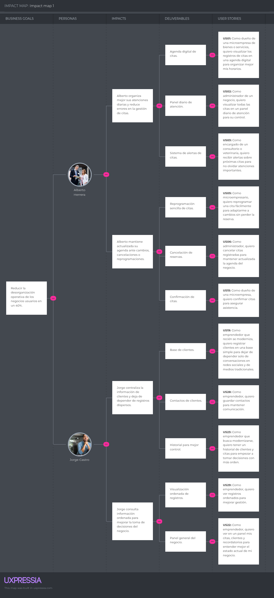
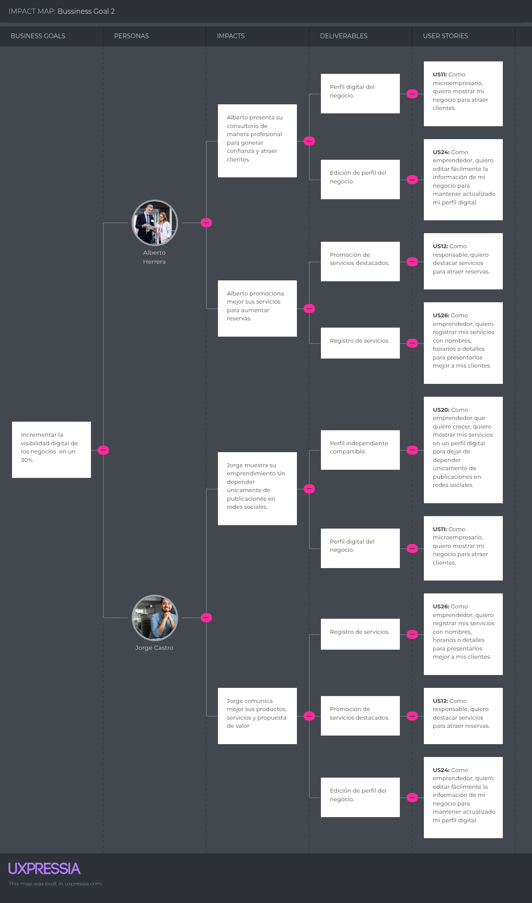
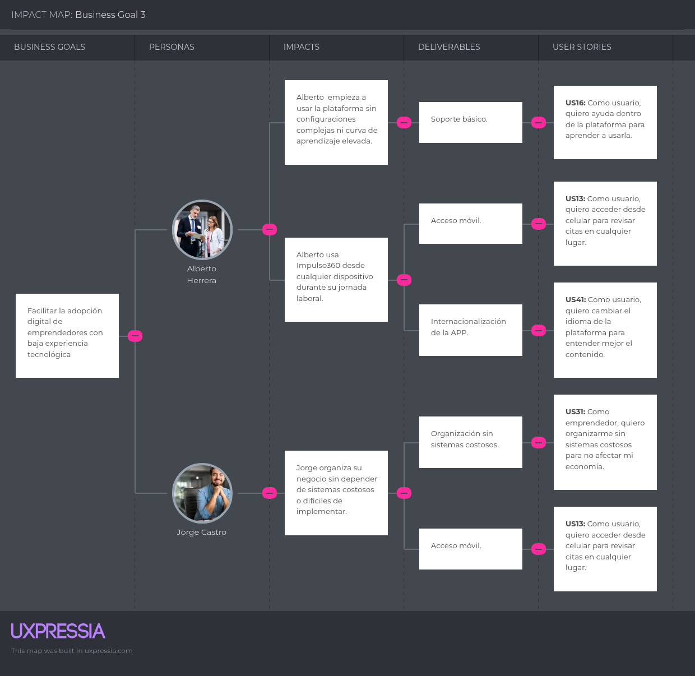

# Capítulo III: Requirements Specification
## 3.1. User Stories 

**Épicas**

| Epic/ Story ID | Título | Descripción |
| :---- | :---- | :---- |
| EP01 | Gestión de citas | Como dueño de un negocio de servicios, quiero gestionar mis citas en un solo sistema para mantener el control de mi agenda. |
| EP02 | Gestión de clientes | Como dueño de un negocio de servicios, quiero administrar la información de mis clientes para mejorar el seguimiento y la atención. |
| EP03 | Perfil digital y promoción | Como emprendedor, quiero tener presencia digital para mostrar mis servicios y atraer más clientes. |
| EP04 | Usabilidad y Accesibilidad | Como usuario con baja experiencia digital quiero una plataforma simples y accesibles para poder usarla sin complicaciones |
| EP05 | Control del negocio | Como dueño de un negocio de servicios, quiero visualizar el estado general de mi negocio para tomar mejores decisiones. |
| EP06 | Landing Page | Como visitante, quiero conocer la propuesta de valor de Impulso360 para decidir si la plataforma se adapta a mi negocio. |
| EP07 | RESTful API | Como developer, quiero implementar servicios RESTful para permitir la comunicación entre frontend, backend y base de datos. |

**User Stories**

| Epic/ Story ID | Título | Descripción | Criterios de Aceptación | Relaciona con (Epic ID) |
| :---- | :---- | :---- | :---- | :---- |
| US01 | Visualización digital de citas | Como dueño de una microempresa de servicios, quiero visualizar mis citas en vista diaria y semanal, para organizar mejor mis horarios según fecha, servicio y estado. | **Escenario 1:** Dado que el dueño tiene citas registradas, cuando accede a la agenda y selecciona vista diaria, entonces visualiza las citas con fecha, hora, cliente, servicio y estado.  **Escenario 2:** Dado que el dueño desea revisar varios días, cuando selecciona la vista semanal, entonces visualiza las citas organizadas por día y horario.  **Escenario 3:** Dado que existen citas con diferentes estados, cuando aplica un filtro por estado, entonces visualiza solo las citas confirmadas, pendientes o canceladas según corresponda. | EP01 |
| US02 | Panel diario de atención | Como administrador del negocio, quiero visualizar un resumen operativo del día, para conocer rápidamente cuántas citas están confirmadas, pendientes, canceladas y próximas a iniciar. | **Escenario 1:** Dado que el administrador ha iniciado sesión, cuando accede al panel diario, entonces visualiza indicadores de citas confirmadas, pendientes, canceladas y próximas.  **Escenario 2:** Dado que existen citas pendientes, cuando selecciona el indicador de pendientes, entonces el sistema lo dirige al listado filtrado de citas pendientes. | EP05 |
| US03 | Alertas internas de citas próximas | Como encargado de un consultorio o veterinaria, quiero recibir una notificación interna antes de una cita próxima, para preparar la atención con anticipación. | **Escenario 1:** Dado que existe una cita programada para los próximos 30 minutos, cuando se cumple el tiempo de anticipación configurado, entonces el sistema muestra una notificación interna con cliente, servicio y hora.  **Escenario 2:** Dado que no existen citas próximas, cuando el encargado revisa sus notificaciones, entonces el sistema no muestra alertas pendientes. | EP01 |
| US04 | Registro de clientes con validación | Como responsable del negocio, quiero registrar los datos obligatorios de mis clientes, para tener información completa y confiable al asignarlos a una cita. | **Escenario 1:** Dado que el responsable completa nombre, teléfono y correo del cliente, cuando guarda el formulario, entonces el cliente queda registrado correctamente.  **Escenario 2:** Dado que el responsable deja vacío un campo obligatorio, cuando intenta guardar el registro, entonces el sistema muestra qué campo debe completar.  **Escenario 3:** Dado que el teléfono o correo ya pertenece a otro cliente, cuando intenta registrar el cliente, entonces el sistema muestra una advertencia de posible duplicado. | EP02 |
| US05 | Reprogramación sencilla de citas | **Como** microempresario, **quiero** reprogramar una cita fácilmente **para** adaptarme a cambios sin perder la reserva. | **Escenario 1:** El microempresario reprograma una cita sin conflictos. • **Dado** que el microempresario selecciona una cita existente desde la agenda. • **Cuando** elige una nueva fecha y hora disponible y confirma el cambio. • **Entonces** la cita se actualiza con el nuevo horario y se mantiene el registro del cliente y servicio.  **Escenario 2:** El nuevo horario genera conflicto con otra cita. • **Dado** que el microempresario intenta reprogramar una cita a un horario ya ocupado. • **Cuando** selecciona la nueva fecha y hora y presiona Guardar. • **Entonces** el sistema muestra un aviso de conflicto de horario y solicita elegir otro horario. | EP01 |
| US06 | Cancelación de reservas | **Como** administrador, **quiero** cancelar citas registradas **para** mantener actualizada la agenda del negocio. | **Escenario 1:** El administrador cancela una cita registrada. • **Dado** que el administrador selecciona una cita activa desde la agenda. • **Cuando** elige la opción Cancelar y confirma la acción. • **Entonces** la cita queda marcada como cancelada y el horario queda disponible para nuevas reservas.  **Escenario 2:** El administrador cancela sin confirmar. • **Dado** que el administrador selecciona la opción Cancelar sobre una cita. • **Cuando** cierra el diálogo de confirmación sin confirmar. • **Entonces** la cita permanece activa y sin cambios en la agenda. | EP01 |
| US07 | Panel del negocio | **Como** emprendedor, **quiero** ver en un panel mis citas, clientes y recordatorios **para** entender mejor el estado actual de mi negocio. | **Escenario 1:** Visualización general del panel. • **Dado** que el emprendedor ha iniciado sesión en la plataforma. • **Cuando** accede al panel principal del negocio. • **Entonces** visualiza un resumen de citas, clientes y recordatorios.  **Escenario 2:** Navegación desde el panel. • **Dado** que el panel muestra diferentes secciones. • **Cuando** el usuario selecciona una sección específica, como citas o clientes. • **Entonces** es redirigido al módulo correspondiente. | EP05 |
| US08 | Historial detallado por cliente | Como dueño del negocio, quiero consultar el historial de citas de un cliente, para revisar sus atenciones anteriores, servicios recibidos, notas y estados. | **Escenario 1:** Dado que el cliente tiene citas anteriores, cuando el dueño accede a su historial, entonces visualiza fecha, servicio, estado y notas de cada cita.  **Escenario 2:** Dado que el cliente no tiene citas registradas, cuando se consulta su historial, entonces el sistema muestra un mensaje indicando que no hay registros. | EP02 |
| US09 | Clasificación de citas por servicio | Como encargado del negocio, quiero clasificar las citas por tipo de servicio, para priorizar la atención según el servicio solicitado por cada cliente. | **Escenario 1:** Dado que existen citas con distintos servicios, cuando el encargado aplica un filtro por servicio, entonces el sistema muestra solo las citas asociadas a ese servicio.  **Escenario 2:** Dado que el encargado revisa una cita, cuando abre su detalle, entonces visualiza el servicio asociado a esa cita. | EP01 |
| US10 | Notas internas por cita | Como administrador del negocio, quiero agregar y editar notas internas en una cita, para recordar detalles importantes de la atención sin alterar los datos principales de la reserva. | **Escenario 1:** Dado que el administrador accede al detalle de una cita, cuando escribe una nota y guarda los cambios, entonces la nota queda asociada a esa cita.  **Escenario 2:** Dado que una cita ya tiene una nota registrada, cuando el administrador la edita, entonces el sistema guarda la nueva versión.  **Escenario 3:** Dado que un usuario sin permiso intenta editar la nota, cuando realiza la acción, entonces el sistema bloquea la modificación. | EP01 |
| US11 | Creación de perfil digital | Como microempresario, quiero crear un perfil digital con los datos principales de mi negocio, para presentar mi negocio de manera profesional a mis clientes. | **Escenario 1:** Dado que el microempresario completa nombre del negocio, descripción, horario y datos de contacto, cuando guarda la información, entonces el perfil queda creado en estado borrador.  **Escenario 2:** Dado que falta un dato obligatorio, cuando intenta guardar el perfil, entonces el sistema muestra qué información debe completar. | EP03 |
| US11-A | Edición de perfil digital | Como microempresario, quiero editar la información de mi perfil digital, para mantener actualizados mis horarios, descripción, imagen y datos de contacto. | **Escenario 1:** Dado que el perfil digital ya existe, cuando el microempresario modifica la información y guarda los cambios, entonces el sistema actualiza el perfil.  **Escenario 2:** Dado que el usuario desea revisar los cambios antes de publicarlos, cuando selecciona vista previa, entonces visualiza cómo se verá el perfil actualizado. | EP03 |
| US11-B | Publicación de perfil digital | Como microempresario, quiero publicar mi perfil digital mediante un enlace público, para compartir mis servicios con clientes sin depender solo de redes sociales. | **Escenario 1:** Dado que el perfil tiene la información obligatoria completa, cuando el microempresario selecciona publicar, entonces el sistema genera un enlace público del perfil.  **Escenario 2:** Dado que el perfil está incompleto, cuando intenta publicarlo, entonces el sistema indica qué datos faltan completar. | EP03 |
| US12 | Promoción de servicios destacados | Como responsable del negocio, quiero destacar hasta tres servicios en mi perfil digital, para promocionar las atenciones más importantes de mi negocio. | **Escenario 1:** Dado que el responsable selecciona un servicio activo, cuando lo marca como destacado y guarda, entonces el servicio aparece resaltado en el perfil digital.  **Escenario 2:** Dado que ya existen tres servicios destacados, cuando intenta destacar un cuarto servicio, entonces el sistema muestra un aviso indicando el límite permitido. | EP03 |
| US13 | Interfaz responsive para acceso móvil | Como usuario de la plataforma, quiero que la aplicación se adapte correctamente a celulares y tablets, para revisar citas y clientes desde cualquier dispositivo. | **Escenario 1:** Dado que el usuario accede desde un celular, cuando ingresa a la plataforma, entonces el menú, las tarjetas y las tablas se ajustan al tamaño de pantalla.  **Escenario 2:** Dado que el usuario accede desde una tablet, cuando navega por agenda, clientes o servicios, entonces puede visualizar y usar las funciones sin pérdida de información. | EP04 |
| US14 | Gestión de citas perdidas | Como administrador del negocio, quiero identificar citas perdidas, para contactar al cliente o reprogramar la atención. | **Escenario 1:** Dado que una cita pasó su horario sin ser confirmada como atendida, cuando el sistema actualiza su estado, entonces la cita aparece como perdida.  **Escenario 2:** Dado que existen citas perdidas, cuando el administrador aplica el filtro correspondiente, entonces visualiza solo esas citas.  **Escenario 3:** Dado que el administrador selecciona una cita perdida, cuando elige una acción, entonces puede contactar al cliente o iniciar una reprogramación. | EP01 |
| US15 | Confirmación manual de citas | Como administrador del negocio, quiero confirmar manualmente una cita pendiente, para asegurar que el cliente asistirá en el horario registrado. | **Escenario 1:** Dado que existe una cita pendiente, cuando el administrador selecciona confirmar, entonces el estado cambia a confirmada.  **Escenario 2:** Dado que la cita está cancelada o perdida, cuando el administrador intenta confirmarla, entonces el sistema impide la acción y muestra un mensaje de estado inválido. | EP01 |
| US15-A | Confirmación automática de citas | Como administrador del negocio, quiero que el sistema confirme automáticamente una cita cuando el cliente responda al recordatorio, para reducir confirmaciones manuales. | **Escenario 1:** Dado que el cliente recibe un recordatorio de cita, cuando confirma su asistencia, entonces el sistema cambia el estado de la cita a confirmada.  **Escenario 2:** Dado que el cliente no responde al recordatorio, cuando llega el tiempo límite de confirmación, entonces la cita permanece como pendiente. | EP01 |
| US16 | Preguntas frecuentes de ayuda | Como usuario de la plataforma, quiero revisar preguntas frecuentes, para resolver dudas comunes sin contactar soporte. | **Escenario 1:** Dado que el usuario accede a la sección de preguntas frecuentes, cuando selecciona una pregunta, entonces el sistema muestra la respuesta correspondiente.  **Escenario 2:** Dado que el usuario revisa varias preguntas, cuando abre una nueva pregunta, entonces puede leer su respuesta sin salir de la sección. | EP04 |
| US16-A | Tutorial interactivo de uso | Como usuario nuevo, quiero seguir un tutorial interactivo, para aprender las funciones principales de la plataforma paso a paso. | **Escenario 1:** Dado que el usuario ingresa por primera vez, cuando accede a la sección de ayuda, entonces visualiza un tutorial con pasos ordenados.  **Escenario 2:** Dado que el usuario completa un paso del tutorial, cuando vuelve a la sección, entonces el sistema muestra ese paso como completado. | EP04 |
| US16-B | Buscador de ayuda | Como usuario de la plataforma, quiero buscar dudas por palabra clave, para encontrar rápidamente guías o respuestas relacionadas. | **Escenario 1:** Dado que el usuario escribe una palabra clave en el buscador de ayuda, cuando existen coincidencias, entonces el sistema muestra guías o preguntas relacionadas.  **Escenario 2:** Dado que no existen coincidencias, cuando realiza la búsqueda, entonces el sistema muestra un mensaje indicando que no se encontraron resultados. | EP04 |
| US17 | Reserva de cita por cliente | Como cliente de un negocio de servicios, quiero reservar una cita seleccionando servicio, fecha y horario disponible, para asegurar mi atención sin depender de mensajes por WhatsApp. | **Escenario 1:** Dado que existen horarios disponibles, cuando el cliente selecciona servicio, fecha y hora, entonces el sistema registra la reserva con estado pendiente.  **Escenario 2:** Dado que no existen horarios disponibles para la fecha elegida, cuando el cliente intenta reservar, entonces el sistema muestra horarios alternativos. | EP01 |
| US18 | Onboarding inicial guiado | Como emprendedor con baja experiencia digital, quiero completar un onboarding inicial de tres pasos, para configurar mi negocio sin apoyo técnico. | **Escenario 1:** Dado que el emprendedor ingresa por primera vez, cuando inicia el onboarding, entonces visualiza los pasos configurar perfil, agregar servicios y registrar primera cita.  **Escenario 2:** Dado que el emprendedor completa un paso, cuando regresa al onboarding, entonces el sistema lo marca como completado.  **Escenario 3:** Dado que el emprendedor aún tiene pasos pendientes, cuando revisa el onboarding, entonces el sistema muestra qué acciones faltan. | EP04 |
| US19 | Base de clientes con validación única | Como emprendedor que recién se moderniza, quiero registrar clientes en una base simple validando teléfono y correo únicos, para dejar de depender solo de conversaciones en redes sociales. | **Escenario 1:** Dado que el emprendedor registra un cliente con teléfono y correo no registrados antes, cuando guarda los datos, entonces el cliente queda creado correctamente.  **Escenario 2:** Dado que el teléfono o correo ya existe, cuando intenta registrar el cliente, entonces el sistema muestra una advertencia de duplicidad.  **Escenario 3:** Dado que el emprendedor busca un cliente existente, cuando escribe nombre, teléfono o correo, entonces el sistema muestra las coincidencias relacionadas. | EP02 |
| US20 | Perfil público independiente | Como emprendedor que quiere crecer, quiero compartir una URL pública de mi perfil digital, para mostrar mis servicios y datos del negocio sin depender únicamente de redes sociales. | **Escenario 1:** Dado que el perfil digital está publicado, cuando el emprendedor copia su URL pública y la comparte, entonces el cliente puede acceder a los servicios, horarios y datos de contacto del negocio.  **Escenario 2:** Dado que el perfil no está publicado, cuando el cliente intenta acceder a la URL, entonces el sistema muestra que el perfil no está disponible. | EP03 |
| US21 | Tutorial interactivo de aprendizaje | Como emprendedor, quiero completar un tutorial interactivo, para aprender las funciones principales de la plataforma desde los primeros días. | **Escenario 1:** Dado que el emprendedor inicia el tutorial, cuando completa todos los pasos, entonces conoce las funciones principales de la plataforma.  **Escenario 2:** Dado que abandona el tutorial antes de terminarlo, cuando vuelve a ingresar, entonces el sistema mantiene el avance guardado. | EP04 |
| US21-A | Guías rápidas por tarea | Como emprendedor, quiero consultar guías rápidas por tarea específica, para resolver dudas sobre citas, clientes, servicios o perfil digital. | **Escenario 1:** Dado que el emprendedor accede a guías rápidas, cuando selecciona una guía, entonces visualiza instrucciones breves paso a paso.  **Escenario 2:** Dado que el emprendedor necesita ayuda sobre una tarea concreta, cuando usa el buscador, entonces el sistema muestra guías relacionadas. | EP04 |
| US22 | Panel general del negocio | **Como** emprendedor, **quiero** ver en un panel mis citas, clientes y recordatorios, **para** entender mejor el estado actual de mi negocio. | **Escenario 1:** El emprendedor revisa el estado de su negocio desde el panel. • **Dado** que el emprendedor accede al panel principal de la plataforma. • **Cuando** visualiza el resumen del día con citas, clientes y recordatorios. • **Entonces** obtiene una visión completa y actualizada del estado de su negocio en un solo vistazo.  **Escenario 2:** El emprendedor detecta citas pendientes desde el panel. • **Dado** que el panel muestra un indicador de citas pendientes de confirmación. • **Cuando** el emprendedor selecciona el indicador de citas pendientes. • **Entonces** es redirigido a la lista de citas pendientes para gestionarlas. | EP05 |
| US23 | Visualización del Hero de la landing | Como visitante, quiero ver una sección principal clara en la landing page, para entender rápidamente qué ofrece Impulso360 y decidir si deseo conocer más. | **Escenario 1:** Dado que el visitante ingresa a la landing page, cuando carga la página, entonces visualiza el nombre del producto, propuesta de valor y botón principal.  **Escenario 2:** Dado que el visitante quiere continuar, cuando hace clic en el botón principal, entonces es dirigido a registro, contacto o una sección informativa relevante. | EP06 |
| US24 | Edición de perfil del negocio | **Como** emprendedor, **quiero** editar fácilmente la información de mi negocio, **para** mantener actualizado mi perfil digital. | **Escenario 1:** El emprendedor actualiza el horario de atención de su negocio. • **Dado** que el emprendedor accede al módulo de edición de su perfil digital. • **Cuando** modifica los horarios de atención y guarda los cambios. • **Entonces** el perfil público se actualiza mostrando los nuevos horarios de inmediato.  **Escenario 2:** El emprendedor previsualiza los cambios antes de publicar. • **Dado** que el emprendedor ha realizado cambios en la descripción del negocio. • **Cuando** selecciona la opción de vista previa. • **Entonces** visualiza cómo quedará el perfil público con los cambios antes de confirmar su publicación. | EP03 |
| US25 | Confirmación ordenada de reservas | **Como** emprendedor, **quiero** confirmar reservas desde un sistema ordenado **para** mejorar seguimiento. | **Escenario 1:** Confirmación desde panel. • **Dado** que existen reservas pendientes. • **Cuando** el usuario confirma una reserva. • **Entonces** el estado se actualiza correctamente.  **Escenario 2:** Visualización de confirmaciones. • **Dado** que existen reservas confirmadas. • **Cuando** el usuario revisa la lista. • **Entonces** identifica claramente su estado. | EP01 |
| US26 | Registro de servicios | **Como** emprendedor, **quiero** registrar mis servicios con nombres, horarios o detalles **para** presentarlos mejor a mis clientes. | **Escenario 1:** Registro de servicio. • **Dado** que el usuario accede al módulo de servicios. • **Cuando** ingresa datos y guarda. • **Entonces** el servicio queda registrado.  **Escenario 2:** Edición de servicio. • **Dado** que existe un servicio registrado. • **Cuando** el usuario lo modifica. • **Entonces** los cambios se guardan correctamente. | EP03 |
| US27 | Planificación anticipada | **Como** emprendedor, **quiero** ver citas futuras **para** planificar mi trabajo. | **Escenario 1:** Consulta de agenda futura. • **Dado** que existen citas futuras. • **Cuando** el usuario revisa la agenda. • **Entonces** visualiza las citas programadas.  **Escenario 2:** Organización del día. • **Dado** que el usuario revisa sus citas. • **Cuando** analiza la agenda. • **Entonces** puede planificar su jornada. | EP01 |
| US28 | Contactos de clientes | **Como** emprendedor, **quiero** guardar contactos **para** mantener comunicación. | **Escenario 1:** Registro de contacto. • **Dado** que el usuario ingresa datos del cliente. • **Cuando** guarda la información. • **Entonces** el contacto queda registrado.  **Escenario 2:** Consulta de contacto. • **Dado** que existen contactos guardados. • **Cuando** el usuario busca uno. • **Entonces** el sistema lo muestra. | EP02 |
| US29 | Visualización ordenada | **Como** emprendedor, **quiero** ver registros ordenados **para** mejorar gestión. | **Escenario 1:** Ordenamiento de registros. • **Dado** que existen múltiples registros. • **Cuando** el usuario aplica orden. • **Entonces** los datos se organizan correctamente.  **Escenario 2:** Aplicación de filtros. • **Dado** que el usuario aplica filtros. • **Cuando** selecciona criterios. • **Entonces** el sistema muestra resultados filtrados. | EP05 |
| US30 | Crecimiento gradual de funcionalidades | **Como** emprendedor, **quiero** usar funciones progresivamente **para** adaptarme. | **Escenario 1:** Uso de funciones básicas. • **Dado** que el usuario inicia. • **Cuando** utiliza la plataforma. • **Entonces** accede a funciones esenciales.  **Escenario 2:** Acceso a nuevas funciones. • **Dado** que el usuario continúa usando la plataforma. • **Cuando** explora más opciones. • **Entonces** accede a funciones adicionales. | EP04 |
| US31 | Organización sin sistemas costosos | **Como** emprendedor, **quiero** organizarme sin sistemas costosos **para** no afectar mi economía. | **Escenario 1:** Acceso a funciones sin pago alto. • **Dado** que el usuario evalúa la plataforma. • **Cuando** revisa costos. • **Entonces** identifica que es accesible.  **Escenario 2:** Uso continuo del sistema. • **Dado** que el usuario usa la plataforma. • **Cuando** gestiona su negocio. • **Entonces** no requiere herramientas externas costosas. | EP04 |
| US32 | Visualización del Hero | **Como** visitante, **quiero** ver una sección principal clara **para** entender rápidamente qué ofrece Impulso360. | **Escenario 1:** Visualización inicial del Hero. • **Dado** que el usuario ingresa a la landing. • **Cuando** carga la página. • **Entonces** visualiza título, descripción y botón principal.  **Escenario 2:** Interacción con el botón principal. • **Dado** que el usuario interactúa con el Hero. • **Cuando** hace clic en el botón. • **Entonces** es redirigido correctamente. | EP06 |
| US33 | Consulta de beneficios de la landing | Como visitante, quiero revisar beneficios concretos de Impulso360, para entender cómo la plataforma ayuda a organizar citas, clientes y recordatorios. | **Escenario 1:** Dado que el visitante llega a la sección de beneficios, cuando revisa el contenido, entonces visualiza beneficios relacionados con orden de citas, ahorro de tiempo, reducción de olvidos y mejor seguimiento de clientes.  **Escenario 2:** Dado que el visitante se interesa por los beneficios, cuando selecciona el CTA de la sección, entonces es dirigido a contacto o registro. | EP06 |
| US34 | Revisión de características | **Como** visitante, **quiero** conocer las características de la plataforma **para** evaluar si cubre mis necesidades. | **Escenario 1:** Visualización de características. • **Dado** que el usuario accede a la sección. • **Cuando** revisa características. • **Entonces** visualiza funcionalidades clave.  **Escenario 2:** Comparación de capacidades. • **Dado** que el usuario compara opciones. • **Cuando** analiza características. • **Entonces** comprende capacidades del sistema. | EP06 |
| US35 | Comparación de planes | **Como** visitante, **quiero** revisar los planes disponibles **para** elegir una opción adecuada a mi negocio. | **Escenario 1:** Visualización de planes. • **Dado** que el usuario accede a planes. • **Cuando** los visualiza. • **Entonces** ve precios y beneficios.  **Escenario 2:** Comparación de planes. • **Dado** que el usuario compara planes. • **Cuando** revisa diferencias. • **Entonces** puede elegir uno. | EP06 |
| US36 | Conocimiento del equipo | **Como** visitante, **quiero** conocer información sobre el equipo **para** generar confianza en la solución. | **Escenario 1:** Visualización de la sección Nosotros. • **Dado** que el usuario accede a la sección nosotros. • **Cuando** visualiza contenido. • **Entonces** ve información del equipo.  **Escenario 2:** Generación de confianza. • **Dado** que el usuario revisa la sección. • **Cuando** analiza contenido. • **Entonces** genera confianza. | EP06 |
| US37 | Consulta de preguntas frecuentes | **Como** visitante, **quiero** revisar preguntas frecuentes **para** resolver dudas antes de usar la plataforma. | **Escenario 1:** Despliegue de preguntas frecuentes. • **Dado** que el usuario accede a FAQ. • **Cuando** selecciona una pregunta. • **Entonces** se despliega la respuesta.  **Escenario 2:** Revisión de dudas frecuentes. • **Dado** que el usuario navega preguntas. • **Cuando** revisa varias. • **Entonces** resuelve dudas. | EP06 |
| US38 | Navegación responsive | **Como** visitante, **quiero** navegar la landing page desde celular **para** consultar la información de forma cómoda. | **Escenario 1:** Navegación desde celular. • **Dado** que el usuario usa celular. • **Cuando** navega. • **Entonces** el diseño se adapta.  **Escenario 2:** Navegación desde distintos dispositivos. • **Dado** que el usuario cambia dispositivo. • **Cuando** accede desde tablet o PC. • **Entonces** la interfaz sigue funcionando correctamente. | EP06 |
| US39 | Acción de contacto o registro | **Como** visitante, **quiero** acceder a una opción de contacto o registro **para** iniciar el uso de la plataforma. | **Escenario 1:** Acceso mediante botón CTA. • **Dado** que el usuario ve botón CTA. • **Cuando** hace clic. • **Entonces** accede a registro o contacto.  **Escenario 2:** Confirmación de acción. • **Dado** que el usuario completa la acción. • **Cuando** envía datos. • **Entonces** recibe confirmación. | EP06 |
| US40 | Internacionalización | **Como** visitante, **quiero** ver la landing en mi idioma **para** entender la propuesta de valor. | **Escenario 1:** Cambio de idioma en la landing. • **Dado** que el usuario cambia idioma. • **Cuando** selecciona otro idioma. • **Entonces** la landing se traduce.  **Escenario 2:** Navegación en idioma elegido. • **Dado** que el usuario navega. • **Cuando** revisa secciones. • **Entonces** todo el contenido está en el idioma elegido. | EP04 |
| US41 | Internacionalización de la APP | **Como** usuario, **quiero** cambiar el idioma de la plataforma **para** entender mejor el contenido. | **Escenario 1:** Cambio de idioma en la plataforma. • **Dado** que el usuario cambia idioma. • **Cuando** selecciona opción. • **Entonces** la interfaz cambia completamente.  **Escenario 2:** Persistencia del idioma seleccionado. • **Dado** que el usuario vuelve a ingresar. • **Cuando** inicia sesión. • **Entonces** mantiene el idioma seleccionado. | EP04 |
| TS01 | Autenticación | **Como** Developer, **quiero** implementar endpoints de autenticación **para** permitir el acceso seguro de usuarios. | **Escenario 1:** Inicio de sesión exitoso. • **Dado** credenciales válidas. • **Cuando** se envía POST login. • **Entonces** retorna token.  **Escenario 2:** Inicio de sesión fallido. • **Dado** credenciales inválidas. • **Cuando** se envía request. • **Entonces** retorna error 401. | EP07 |
| TS02 | Gestión de citas | **Como** Developer, **quiero** implementar endpoints para citas **para** permitir crear, consultar, actualizar y cancelar reservas. | **Escenario 1:** Creación de cita. • **Dado** datos válidos. • **Cuando** se envía POST. • **Entonces** crea cita.  **Escenario 2:** Eliminación de cita. • **Dado** ID existente. • **Cuando** se envía DELETE. • **Entonces** elimina cita. | EP07 |
| TS03 | Gestión de clientes | **Como** Developer, **quiero** implementar endpoints para clientes **para** registrar, consultar y actualizar información de clientes. | **Escenario 1:** Registro de cliente. • **Dado** datos válidos. • **Cuando** se envía POST. • **Entonces** registra cliente.  **Escenario 2:** Consulta de cliente. • **Dado** cliente existente. • **Cuando** se consulta. • **Entonces** retorna información. | EP07 |
| TS04 | Servicios del negocio | **Como** Developer, **quiero** implementar endpoints en servicios **para** permitir que cada negocio registre y edite sus servicios. | **Escenario 1:** Creación de servicio. • **Dado** datos válidos. • **Cuando** se envía POST. • **Entonces** crea servicio.  **Escenario 2:** Actualización de servicio. • **Dado** servicio existente. • **Cuando** se actualiza. • **Entonces** guarda cambios. | EP07 |
| TS05 | Perfil digital | **Como** Developer, **quiero** implementar endpoints del perfil del negocio **para** mostrar información pública actualizada. | **Escenario 1:** Consulta de perfil existente. • **Dado** perfil existente. • **Cuando** se consulta. • **Entonces** retorna información.  **Escenario 2:** Actualización de perfil. • **Dado** cambios. • **Cuando** se actualiza. • **Entonces** guarda datos. | EP07 |
| TS06 | Recordatorios | **Como** Developer, **quiero** implementar endpoints de recordatorios **para** gestionar alertas de citas próximas. | **Escenario 1:** Consulta de cita próxima. • **Dado** cita próxima. • **Cuando** se consulta. • **Entonces** retorna alerta.  **Escenario 2:** Consulta sin citas próximas. • **Dado** sin citas. • **Cuando** se consulta. • **Entonces** retorna vacío. | EP07 |

## 3.2. Impact Mapping

**Business Goal 1: Reducir la desorganización operativa de los negocios usuarios en un 40%**

Este primer Business Goal busca reducir los problemas operativos que enfrentan las microempresas y emprendedores al gestionar sus citas y clientes mediante herramientas físicas o separadas.

**Business Goal 2: Incrementar la visibilidad digital de los negocios en un 30%**

El segundo Business goal busca que los usuarios puedan mostrar sus servicios de manera más profesional, clara y accesible. La finalidad es que no dependan únicamente de recomendaciones o redes sociales, sino que cuenten con un espacio digital ordenado para presentar su negocio.

**Business Goal 3: Facilitar la adopción digital**

Este objetivo busca darles a los usuarios de Impulso360 un producto fácil de usar además de altamente accesible, con características como internacionalización y responsive.

## 3.3. Product Backlog

| \#Orden | User Story Id | Título | Descripción | Story Points (1/2/3/5/8) |
| :---- | :---- | :---- | :---- | :---- |
| 1 | US32 | Visualización del Hero | **Como** visitante, **quiero** ver una sección principal clara **para** entender rápidamente qué ofrece Impulso360. | 2 |
| 2 | US33 | Consulta de beneficios | **Como** visitante, **quiero** revisar los beneficios principales **para** identificar cómo la plataforma puede ayudar a mi negocio. | 2 |
| 3 | US34 | Revisión de características | **Como** visitante, **quiero** conocer las características de la plataforma **para** evaluar si cubre mis necesidades. | 2 |
| 4 | US35 | Comparación de planes | **Como** visitante, **quiero** revisar los planes disponibles **para** elegir una opción adecuada a mi negocio. | 2 |
| 5 | US39 | Acción de contacto o registro | **Como** visitante, **quiero** acceder a una opción de contacto o registro **para** iniciar el uso de la plataforma. | 2 |
| 6 | US38 | Navegación responsive | **Como** visitante, **quiero** navegar la landing page desde celular **para** consultar la información de forma cómoda. | 3 |
| 7 | US36 | Conocimiento del equipo | **Como** visitante, **quiero** conocer información sobre el equipo **para** generar confianza en la solución. | 1 |
| 8 | US37 | Consulta de preguntas frecuentes | **Como** visitante, **quiero** revisar preguntas frecuentes **para** resolver dudas antes de usar la plataforma. | 2 |
| 9 | US40 | Internacionalización | **Como** visitante, **quiero** ver la landing en mi idioma **para** entender la propuesta de valor | 3 |
| 10 | US01 | Visualización digital de citas | **Como** dueño de una microempresa de bienes o servicios, **quiero** visualizar los registro de citas en una agenda digital **para** organizar mejor mis horarios. | 5 |
| 11 | US02 | Panel diario de atención | **Como** administrador de un negocio,  **quiero** visualizar todas las citas en un panel diario de atención  **para** su control. | 3 |
| 12 | US03 | Alertas de citas | **Como** encargado de un consultorio o veterinaria, **quiero** recibir alertas sobre próximas citas **para** no olvidar atenciones importantes. | 3 |
| 13 | US05 | Reprogramación sencilla de citas | **Como** microempresario, **quiero** reprogramar una cita fácilmente  **para** adaptarme a cambios sin perder la reserva | 5 |
| 14 | US06 | Cancelación de reservas | **Como** administrador,  **quiero** cancelar citas registradas  **para** mantener actualizada la agenda del negocio | 3 |
| 15 | US09 | Clasificación de citas | **Como** encargado, **quiero** clasificar citas por servicio **para** tener claridad | 2 |
| 16 | US15 | Confirmación de citas | **Como** dueño de una microempresa, **quiero** confirmar citas **para** asegurar asistencia | 3 |
| 17 | US25 | Confirmación ordenada de reservas | **Como** emprendedor, **quiero** confirmar reservas desde un sistema ordenado **para** mejorar seguimiento | 2 |
| 18 | US27 | Planificación anticipada | **Como** emprendedor, **quiero** ver citas futuras **para** planificar mi trabajo | 3 |
| 19 | US10 | Notas por cita | **Como** dueño, **quiero** agregar notas a citas **para** recordar detalles | 2 |
| 20 | US14 | Citas perdidas | **Como** administrador, **quiero** identificar citas perdidas **para** mejorar gestión | 2 |
| 21 | US04 | Registro de datos de clientes | **Como** responsable del negocio,  **quiero** registrar los datos básicos de mis clientes  **para** tener mejor control de quién reserva mis servicios. | 5 |
| 22 | US08 | Historial por cliente | **Como** dueño, **quiero** ver historial de citas **para** mejorar atención | 3 |
| 23 | US19 | Base de clientes | **Como** emprendedor que recién se moderniza,  **quiero** registrar clientes en una base simple,  **para** dejar de depender solo de conversaciones en redes sociales y de medios tradicionales. | 3 |
| 24 | US23 | Historial para mejor control | **Como** emprendedor que busca modernizarse,  **quiero** tener un historial de clientes y citas, **para** empezar a tomar decisiones con más orden.  | 5 |
| 25 | US28 | Contactos de clientes | **Como** emprendedor, **quiero** guardar contactos **para** mantener comunicación | 2 |
| 26 | US11 | Perfil digital | **Como** microempresario, **quiero** mostrar mi negocio **para** atraer clientes | 5 |
| 27 | US12 | Promoción de servicios destacados | **Como** responsable, **quiero** destacar servicios **para** atraer reservas | 3 |
| 28 | US20 | Perfil independiente | **Como** emprendedor que quiere crecer,  **quiero** mostrar mis servicios en un perfil digital,  **para** dejar de depender únicamente de publicaciones en redes sociales. | 2 |
| 29 | US24 | Edición de perfil del negocio | **Como** emprendedor,  **quiero** editar fácilmente la información de mi negocio,  **para** mantener actualizado mi perfil digital. | 3 |
| 30 | US26 | Registro de servicios | **Como** emprendedor, **quiero** registrar mis servicios con nombres, horarios o detalles **para** presentarlos mejor a mis clientes. | 3 |
| 31 | US07 | Panel del negocio | **Como** emprendedor, **quiero** ver en un panel mis citas, clientes y recordatorios **para** entender mejor el estado actual de mi negocio. | 5 |
| 32 | US22 | Panel general del negocio | **Como** emprendedor,  **quiero** ver en un panel mis citas, clientes y recordatorios,  **para** entender mejor el estado actual de mi negocio. | 3 |
| 33 | US29 | Visualización ordenada | **Como** emprendedor, **quiero** ver registros ordenados **para** mejorar gestión | 2 |
| 34 | US17 | Mejora de la experiencia de reserva | **Como** dueño, **quiero** mejorar reservas **para** dar mejor servicio | 3 |
| 35 | US13 | Acceso móvil | **Como** usuario, **quiero** acceder desde celular **para** revisar citas en cualquier lugar | 3 |
| 36 | US16 | Soporte Básico | **Como** usuario, **quiero** ayuda dentro de la plataforma **para** aprender a usarla | 2 |
| 37 | US18 | Inicio simple | **Como** emprendedor, **quiero** empezar fácilmente **para** digitalizarme | 2 |
| 38 | US21 | Aprendizaje rápido de la plataforma | **Como** emprendedor,  **quiero** aprender rápidamente a usar la plataforma,  **para** empezar a obtener beneficios desde los primeros días. | 3 |
| 39 | US30 | Crecimiento gradual de funcionalidades | **Como** emprendedor, **quiero** usar funciones progresivamente **para** adaptarme | 2 |
| 40 | US31 | Organización sin sistemas costosos | **Como** emprendedor, **quiero** organizarme sin sistemas costosos **para** no afectar mi economía | 1 |
| 41 | US41 | Internacionalización de la APP | **Como** usuario, **quiero** cambiar el idioma de la plataforma **para** entender mejor el contenido | 3 |
