# Capítulo V: Product Implementation, Validation & Deployment

## 5.1. Software Configuration Management.

###  5.1.1. Software Development Environment Configuration.

Para el desarrollo de este proyecto se utilizaron las siguientes herramientas tecnológicas: 

| Producto | Propósito en el Proyecto | Categoría | Ruta de descarga/Acceso |
| :---- | :---- | :---- | :---- |
| JetBrains WebStorm | Desarrollo web moderno utilizando tecnologías como Angular y TypeScript | Software Development | [https://www.jetbrains.com/webstorm/](https://www.jetbrains.com/webstorm/) |
| JetBrains IntelliJ | Desarrollo del backend en Spring Boot y lógica del sistema | Software Development | [https://www.jetbrains.com/rider/](https://www.jetbrains.com/rider/) |
| UXPressia | Representación gráfica de los artefactos del needfinding | Product UX/UI Design | [https://uxpressia.com/](https://uxpressia.com/) |
| Figma | Diseño de interfaces y prototipos de usuario. | Product UX/UI Design | [https://www.figma.com/](https://www.figma.com/) |
| Miro | Diseño de DDD | Domain Driven Design | [https://miro.com/es/](https://miro.com/es/)  |
| Visual Paradigm | Modelado UML y diseño de sistemas. | Product UX/UI Design | [https://www.visual-paradigm.com/](https://www.visual-paradigm.com/) |
| GitHub | Gestión de código fuente y trabajo colaborativo. | Collaboration & Version Control Tools | [https://github.com/](https://github.com/) |
| Git Cli | Manejo local del control de versiones. | Version Control | [https://git-scm.com/](https://git-scm.com/) |

###  5.1.2. Source Code Management

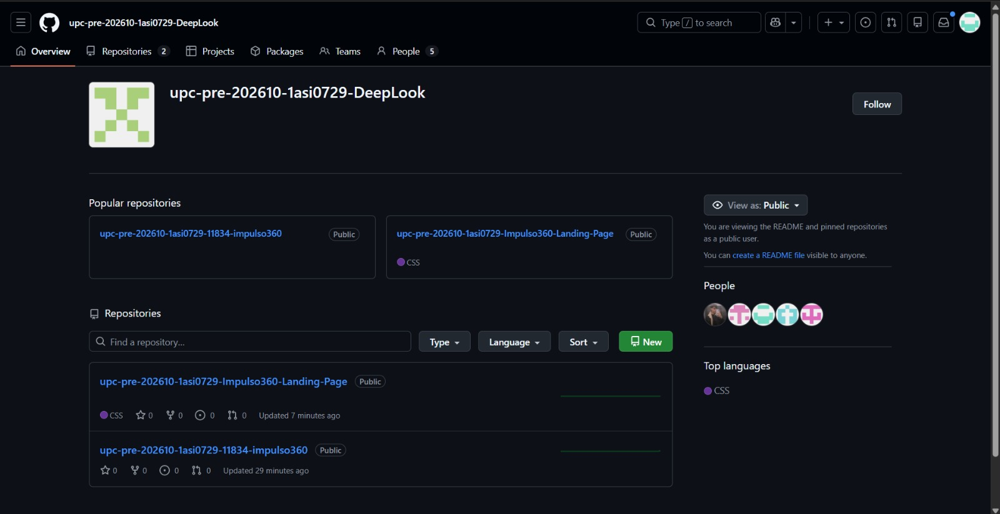

**GitFlow Implementation**

Para aplicar el flujo de trabajo GitFlow en nuestro control de versiones con Git, tomamos como referencia el artículo “A successful Git branching model” de Vincent Driessen. Esta fuente nos ayudó a definir las convenciones que seguiremos en la organización de ramas dentro del proyecto.

- **Main branch**  
  - La rama principal del proyecto es **main**. En ella se mantiene la versión estable del código, es decir, la que representa el estado más confiable y listo para producción del proyecto.
  - **Notación:** main


- **Develop branch**  
  - La rama **develop** contiene los cambios y avances más recientes que todavía no forman parte de la versión final en producción. Esta rama se usa para integrar, revisar y probar las nuevas modificaciones antes de incorporarlas a la rama principal.
  - **Notación:** develop


- **Release branch**  
  - La rama **release** se utiliza para preparar una nueva versión del producto antes de su publicación. En esta rama se pueden realizar ajustes finales y correcciones necesarias, mientras la rama **develop** puede seguir recibiendo nuevos avances del proyecto. 
  - Esta rama se crea a partir de **develop** y, una vez finalizada, debe fusionarse tanto con **develop** como con **main**.
  - **Notación:** release


- **Feature branch**

  - Las ramas **feature** se utilizan para desarrollar nuevas funciones o mejoras específicas del producto que se incorporarán en versiones posteriores. Cada una de estas ramas permite trabajar una característica de forma separada, sin afectar directamente la rama principal de desarrollo. 
  - Estas ramas deben crearse a partir de **develop** y, cuando la funcionalidad esté terminada, deben fusionarse nuevamente en **develop**.
  - **Notación:** feature

**Convenciones de nombres**

* Main branch: `main`
* Develop branch: `develop`
* Feature branches: `feature/<feature-name>`
* Release branches: `release/v<major>.<minor>.<patch>`
* Hotfix branches: `hotfix/<fix-name>`

**Conventional Commits**

Se utilizaron los conventional commit para poder identificar el tipo de cambio realizado, mejora la comunicación dentro del equipo y facilita el seguimiento del avance del proyecto a lo largo del tiempo.

* `feat` : used to add a new feature
* `fix` : used to correct a bug or error
* `docs` : used to update documentation
* `style` : used for formatting or style changes without affecting logic
* `refactor` : used to improve code structure without changing functionality
* `test` : used to add or modify tests
* `chore` : used for maintenance tasks or minor project changes
* `perf` : used to improve performance

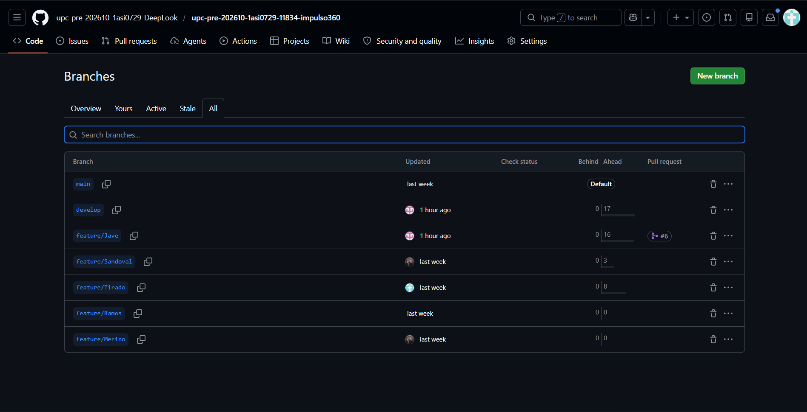

###  5.1.3. Source Code Style Guide & Conventions.

En esta sección explicamos las reglas que seguiremos para escribir el código del proyecto. La idea principal es que todo el equipo programe de una forma parecida, para que el código sea más fácil de leer, corregir y mantener.

Como regla general, usaremos el idioma inglés en el código. Esto incluye nombres de archivos, clases, variables, funciones, métodos y comentarios cuando sean necesarios. Haremos esto porque el inglés es el idioma más usado en programación y nos ayuda a mantener un estándar común en todo el proyecto.

Para nuestro proyecto, aplicaremos reglas de estilo en los siguientes lenguajes y herramientas: HTML, CSS, JavaScript, Java, TypeScript, Angular y Gherkin.

**HTML**

- En HTML seguiremos reglas simples para que la estructura de nuestras páginas sea clara y ordenada. Esto será útil para el Landing Page y también para las vistas de la aplicación web. 
- Escribiremos las etiquetas HTML en minúsculas para mantener el código uniforme.
```html
 <body>
 <p></p>
 </body>
```

- Cada imagen tendrá el atributo ‘’*alt’’*. Esto ayuda a que la página sea más accesible y también permite entender qué representa la imagen si no carga correctamente.
```html
  
```

**CSS**

- En CSS escribiremos estilos claros y organizados. Esto nos permitirá modificar el diseño sin confundirnos y mantener una apariencia consistente en el proyecto.

- Los nombres de las clases e identificadores deberán explicar para qué sirve cada elemento.
```css
  #login {}
  #gallery {} 
  .video {}
```
**JavaScript**

- En JavaScript escribiremos el código de forma clara y separada. Esto nos ayudará a entender mejor la lógica usada en las interacciones del Landing Page.
- Evitaremos juntar muchas instrucciones en una sola línea. Cada parte importante del código debe verse clara.
```javascript
  function showMessage() { 
      console.log('Hello!');
    }
```

- Usaremos lowerCamelCase para variables. Las variables empezarán con minúscula y, si tienen más de una palabra, las siguientes palabras empezarán con mayúscula, así.
```javascript
    let userName = 'Carlos';
    let appointmentCount = 3;
```

- Usaremos *`const`* cuando el valor no cambie y *`let`* cuando el valor sí pueda cambiar. Evitaremos usar *`var`*.
```javascript
   const appName = 'DeepLook';
   let userAge = 25;
   userAge++;
```

**Java**

- En Java aplicaremos reglas simples para que el backend sea ordenado y fácil de mantener. Esto será importante para los servicios web desarrollados con Spring Boot.

- Usaremos *PascalCase* para los nombres de clases. Los nombres empezarán con mayúscula y, si tienen varias palabras, cada palabra también iniciará con mayúscula.

  ```java
  public class UserService {

  }
  ```

- Usaremos *lowerCamelCase* para variables, atributos y métodos. Los nombres empezarán con minúscula y, si tienen varias palabras, las siguientes palabras iniciarán con mayúscula.

  ```java
  private String userName;

  public void registerUser() {

  }
  ```

- Cada método tendrá una función clara. Intentaremos que cada método haga una sola cosa para que sea más fácil encontrar errores o realizar cambios.

  ```java
  public void createAppointment() {
      // Creates a new appointment
  }

  public void cancelAppointment() {
      // Cancels an existing appointment
  }
  ```

**TypeScript**

- En TypeScript seguiremos reglas parecidas a JavaScript, pero usando tipos de datos. Esto nos ayudará a evitar errores dentro de la aplicación web hecha con Angular.

- Usaremos *lowerCamelCase* para variables y funciones. Los nombres serán claros y seguirán el mismo estilo usado en JavaScript.

  ```typescript
  let userEmail: string = 'user@example.com';

  function getUserEmail(): string {
      return userEmail;
  }
  ```

- Indicaremos los tipos de datos para que el código sea más seguro y fácil de entender.

  ```typescript
  let clientName: string = 'Ana';
  let appointmentCount: number = 5;
  let isActive: boolean = true;
  ```

- Usaremos interfaces para objetos. Cuando un objeto tenga varios datos relacionados, usaremos una interfaz para definir su estructura.

  ```typescript
  interface Appointment {
      id: number;
      clientName: string;
      date: string;
      status: string;
  }
  ```

**Angular**

- En Angular organizaremos los archivos de forma clara para que la aplicación web no se vuelva confusa. Separaremos componentes, servicios y modelos según su función.

- Usaremos nombres claros para los componentes. Cada componente tendrá un nombre relacionado con la parte de la aplicación que representa.

  ```text
  home.component.ts
  login.component.ts
  appointment-list.component.ts
  ```

- Usaremos sufijos según el tipo de archivo. El nombre del archivo debe mostrar si corresponde a un componente, servicio, modelo o módulo.

  ```text
  appointment.service.ts
  appointment.model.ts
  appointment.component.ts
  app-routing.module.ts
  ```

- Separaremos los archivos por responsabilidad. Organizaremos el proyecto en carpetas para que sea más fácil encontrar cada parte.

  ```text
  src/
  app/
  appointments/
      components/
      services/
      models/
  ```

- Usaremos servicios para manejar datos. Los servicios se encargarán de conectarse con el API, realizar operaciones importantes y manejar la información. Así evitaremos colocar demasiada lógica dentro de los componentes.

  ```typescript
  @Injectable({
      providedIn: 'root'
  })
  export class AppointmentService {
      getAppointments() {
          return [];
      }
  }
  ```

**Gherkin**

- En Gherkin escribiremos los criterios de aceptación de forma clara. Esto nos permitirá explicar cómo debe comportarse el sistema sin entrar demasiado en detalles técnicos.

- Usaremos títulos claros para los escenarios. Cada escenario tendrá un nombre que explique qué se está validando.

  ```gherkin
  Feature: Login

  Scenario: Successful login
      Given the user is on the login page
      When the user enters valid credentials
      Then the user should access the system
  ```

- Mantendremos la estructura *Given-When-Then* para ordenar correctamente cada escenario.

  - *Given*: situación inicial.
  - *When*: acción que realiza el usuario.
  - *Then*: resultado esperado.

  ```gherkin
  Scenario: Register a new appointment
      Given the user is logged into the system
      When the user registers a new appointment
      Then the appointment should be saved successfully
  ```

- Usaremos *Scenario Outline* para casos repetidos. Cuando existan varios casos parecidos, usaremos esta estructura para no repetir el mismo escenario muchas veces.

  ```gherkin
  Scenario Outline: Search appointments by status
      Given the user is on the appointments page
      When the user filters appointments by "<status>"
      Then the system should show appointments with "<status>"

  Examples:
      | status    |
      | pending   |
      | completed |
      | canceled  |
  ```
### 5.1.4. Software Deployment Configuration. 
Para el despliegue de los productos digitales de Impulso360, el equipo ha configurado GitHub Pages como plataforma de publicación para la Landing Page. Este servicio permite alojar sitios web estáticos directamente desde el repositorio de GitHub, facilitando la visualización del avance del proyecto.

El proceso de despliegue sigue el flujo de trabajo establecido por el equipo:

1. Los cambios se desarrollan en ramas feature, según la tarea asignada a cada integrante.
2. Una vez terminados, los cambios se suben al repositorio remoto y se revisan mediante Pull Request.
3. Después de la aprobación, las ramas feature se integran a la rama develop.
4. Cuando la versión se encuentra estable, los cambios de develop se fusionan con main.
5. GitHub Pages publica automáticamente la versión actualizada de la Landing Page desde la rama configurada.

La URL de despliegue corresponde a la generada por GitHub Pages para el repositorio de Impulso360. En cuanto a la aplicación web completa, frontend, backend y servicios, su configuración de despliegue será definida en sprints posteriores conforme avance el desarrollo del producto.
URL: https://upc-pre-202610-1asi0729-deeplook.github.io/Landing-Page/


## 5.2. Landing Page, Services & Applications Implementation.
###  5.2.1. Sprint 1
#### 5.2.1.1. Sprint Planning 1.

| Sprint \# | Sprint 1 |
| :---- | :---- |
| **Sprint Planning Background** |  |
| Date | 20 \- 04 \- 2026 |
| Location | Reunión virtual via google meets |
| Prepared By | Grupo DeepLook |
| Attendees | Merino Ordinola, Winnie Lisbeth  Sandoval Cueto, Fabian Jesus  Jave Chang, Alejandro Manuel  Ramos Cerdan, Elias Daniel  Tirado Carrera, Gabriela Luciana |
| **Sprint Goal & User Stories** |  |
| Sprint 1 Goal | Nuestro enfoque es desarrollar la landing page de Impulso360. Creemos que esta generará un impacto positivo en sus visitantes lo que atraerá a nuevos clientes. Esto se confirmará cuando el número de clientes suba. |
| Sprint 1 Velocity | 19 Story Points |
| Sum of Story Points | 19 Story Points |

#### 5.2.1.2. Aspect Leaders and Collaborators.

| Team Member | GitHub Username | Navigation Bar / Hero | Beneficios \+ ¿Cómo funciona? | Planes | Contáctenos \+ footer | Internacionalización  |
| :---- | :---- | :---- | :---- | :---- | :---- | :---- |
| Merino Ordinola, Winnie Lisbeth | winniemerino | C | C | L | C | C |
| Sandoval Cueto, Fabian Jesus | JFabianSandoval | C | C | C | L | C |
| Jave Chang, Alejandro Manuel | alejandro202312510 | C | L | C | C | C |
| Ramos Cerdan, Elias Daniel | eliocerdan | L | C | C | C | C |
| Tirado Carrera, Gabriela Luciana | Gaby0443 | C | C | C | L | C |

#### 5.2.1.3. Sprint Backlog 1.

<table>
  <thead>
    <tr>
      <th>Sprint #</th>
      <th colspan="7">Sprint 1</th>
    </tr>
    <tr>
      <th colspan="2">User Story</th>
      <th colspan="6">Work-Item / Task</th>
    </tr>
    <tr>
      <th>id</th>
      <th>Title</th>
      <th>id</th>
      <th>Title</th>
      <th>Description</th>
      <th>Estimation<br>(Hours)</th>
      <th>Assigned To</th>
      <th>Status</th>
    </tr>
  </thead>
  <tbody>
    <tr>
      <td rowspan="3">US23</td>
      <td rowspan="3">Visualización del Hero</td>
      <td>T01</td>
      <td>Implementar barra de navegación</td>
      <td>Crear la barra superior con logo, navegación principal y botón de crear cuenta.</td>
      <td>1</td>
      <td>Elias Ramos Cerdan</td>
      <td>Done</td>
    </tr>
    <tr>
      <td>T02</td>
      <td>Implementar sección Hero</td>
      <td>Maquetar título principal, texto descriptivo, botón CTA e imagen principal de la landing.</td>
      <td>2</td>
      <td>Elias Ramos Cerdan</td>
      <td>Done</td>
    </tr>
    <tr>
      <td>T03</td>
      <td>Configurar navegación del botón principal</td>
      <td>Hacer que el botón “Empezar Ahora” redirija correctamente a la sección de contacto o registro.</td>
      <td>1</td>
      <td>Elias Ramos Cerdan</td>
      <td>Done</td>
    </tr>
    <tr>
      <td>US33</td>
      <td>Consulta de beneficios</td>
      <td>T04</td>
      <td>Redactar beneficios principales</td>
      <td>Adaptar los textos de beneficios a la propuesta de valor de Impulso360.</td>
      <td>1</td>
      <td>Alejandro Jave</td>
      <td>Done</td>
    </tr>
    <tr>
      <td rowspan="2">US34</td>
      <td rowspan="2">Revisión de características</td>
      <td>T05</td>
      <td>Implementar sección de características</td>
      <td>Crear las tarjetas de características de la plataforma como agenda inteligente, gestión de clientes, recordatorios y panel general.</td>
      <td>2</td>
      <td>Alejandro Jave</td>
      <td></td>
    </tr>
    <tr>
      <td>T06</td>
      <td>Ajustar contenido de características</td>
      <td>Revisar que cada característica explique claramente su utilidad para el usuario.</td>
      <td>1</td>
      <td>Alejandro Jave</td>
      <td></td>
    </tr>
    <tr>
      <td rowspan="4">US35</td>
      <td rowspan="4">Comparación de planes</td>
      <td>T07</td>
      <td>Implementar sección de planes</td>
      <td>Crear las tarjetas de planes.</td>
      <td>3</td>
      <td>Winnie Merino</td>
      <td>Done</td>
    </tr>
    <tr>
      <td>T08</td>
      <td>Agregar precios y beneficios por plan</td>
      <td>Colocar precios, características incluidas y botones de selección para cada plan.</td>
      <td>2</td>
      <td>Winnie Merino</td>
      <td>Done</td>
    </tr>
    <tr>
      <td>T09</td>
      <td>Implementar selector mensual/anual</td>
      <td>Agregar el control visual para alternar entre modalidad mensual y anual.</td>
      <td>2</td>
      <td>Winnie Merino</td>
      <td>Done</td>
    </tr>
    <tr>
      <td>T10</td>
      <td>Agregar CTA de asesoría</td>
      <td>Implementar el bloque “¿No sabes qué plan elegir?” con botón de solicitud de asesoría.</td>
      <td>1</td>
      <td>Winnie Merino</td>
      <td>Done</td>
    </tr>
    <tr>
      <td rowspan="3">US38</td>
      <td rowspan="3">Navegación responsive</td>
      <td>T11</td>
      <td>Adaptar Header a dispositivos móviles</td>
      <td>Ajustar navegación, logo y botones para pantallas pequeñas.</td>
      <td>2</td>
      <td>Todos</td>
      <td>Done</td>
    </tr>
    <tr>
      <td>T12</td>
      <td>Adaptar secciones principales a mobile</td>
      <td>Ajustar Hero, beneficios, características, planes y contacto para vista móvil.</td>
      <td>2</td>
      <td>Todos</td>
      <td>Done</td>
    </tr>
    <tr>
      <td>T13</td>
      <td>Validar diseño responsive</td>
      <td>Probar la landing en desktop, tablet y celular para verificar que no existan desbordes ni problemas visuales.</td>
      <td>2</td>
      <td>Todos</td>
      <td>Done</td>
    </tr>
    <tr>
      <td rowspan="4">US39</td>
      <td rowspan="4">Acción de contacto o registro</td>
      <td>T14</td>
      <td>Implementar sección de contacto</td>
      <td>Crear el bloque “Contáctanos” con texto, beneficios de contacto y formulario de solicitud.</td>
      <td>3</td>
      <td>Gabriela Tirado</td>
      <td>Done</td>
    </tr>
    <tr>
      <td>T15</td>
      <td>Crear formulario de solicitud</td>
      <td>Agregar campos de nombre, negocio, correo, celular, tipo de negocio, necesidad y mensaje.</td>
      <td>2</td>
      <td>Gabriela Tirado</td>
      <td>Done</td>
    </tr>
    <tr>
      <td>T16</td>
      <td>Agregar validaciones básicas del formulario</td>
      <td>Verificar campos obligatorios y aceptación de política de privacidad.</td>
      <td>2</td>
      <td>Gabriela Tirado</td>
      <td>Done</td>
    </tr>
    <tr>
      <td>T17</td>
      <td>Implementar Footer</td>
      <td>Crear pie de página con logo, derechos reservados y enlaces legales.</td>
      <td>1</td>
      <td>Gabriela Tirado</td>
      <td>Done</td>
    </tr>
    <tr>
      <td rowspan="3">US40</td>
      <td rowspan="3">Internacionalización</td>
      <td>T18</td>
      <td>Preparar textos para internacionalización</td>
      <td>Separar textos principales de la landing para permitir su traducción.</td>
      <td>2</td>
      <td>Fabian Sandoval</td>
      <td>Done</td>
    </tr>
    <tr>
      <td>T19</td>
      <td>Crear recursos de idioma español e inglés</td>
      <td>Definir claves de traducción para Header, Hero, beneficios, planes, contacto y Footer.</td>
      <td>3</td>
      <td>Fabian Sandoval</td>
      <td>Done</td>
    </tr>
    <tr>
      <td>T20</td>
      <td>Validar cambio de idioma en la landing</td>
      <td>Comprobar que las secciones mantengan coherencia visual al cambiar de idioma.</td>
      <td>2</td>
      <td>Fabian Sandoval</td>
      <td>Done</td>
    </tr>
  </tbody>
</table>

#### 5.2.1.4. 


Durante el Sprint 1, el equipo avanzó en la implementación inicial del Landing Page de Impulso360. Se desarrollaron las secciones principales de la página, incluyendo el inicio, la sección informativa, los planes y el formulario de contacto. Estos avances fueron registrados en GitHub mediante commits realizados en ramas feature, siguiendo GitFlow y Conventional Commits.

| Repository | Branch | Commit Id | Commit Message | Commit Message Body | Commited on (Date) |
|---|---|---|---|---|---|
| upc-pre-202610-1asi0729-DeepLook Landing-Page | feature/iniciolanding | cc4662ae8d83c99913aab997d6fb19597edaf4a8 | feat: add navigation bar and hero section | Implemented the main section with title, description, buttons and visual layout for the Landing Page. | Committed on April 26, 2026 |
| upc-pre-202610-1asi0729-DeepLook Landing-Page | feature/contacto | e8779e69b7c1fc29715c6417a7bb9fb599cc7e2c | feat: add plans contact and footer | Implemented the plans, contact and footer sections for the Landing Page, including pricing cards, contact form layout and final page structure. | Committed on April 26, 2026 |
| upc-pre-202610-1asi0729-DeepLook Landing-Page | feature/beneficioslanding | 7da9b4e50b2012d10a1e08e54a5682795bb4deac | feat: Update navigation link and add 'Cómo funciona' section | Added an information section explaining how Impulso360 helps entrepreneurs manage appointments, clients and reminders. | Committed on April 26, 2026 |

#### 5.2.1.5. Execution Evidence for Sprint Review.

Para este primer sprint se realizó la primera versión de la Landing Page, con cada aspecto propuesto para el sprint que abarca el inicio, beneficios, planes y contacto. Asimismo se implemento la interna 

1. Inicio

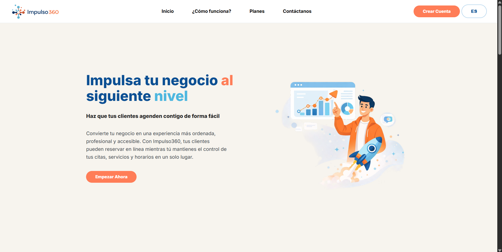

2. Beneficios

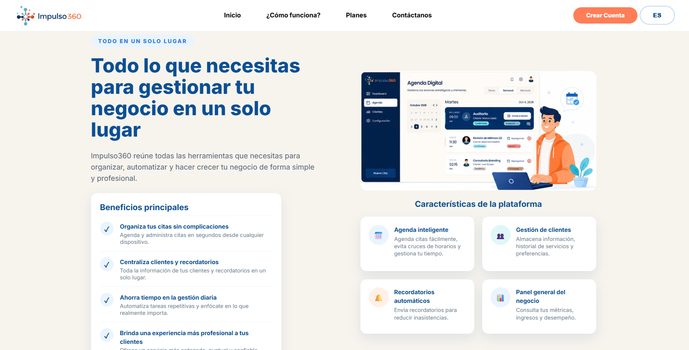

3. Planes

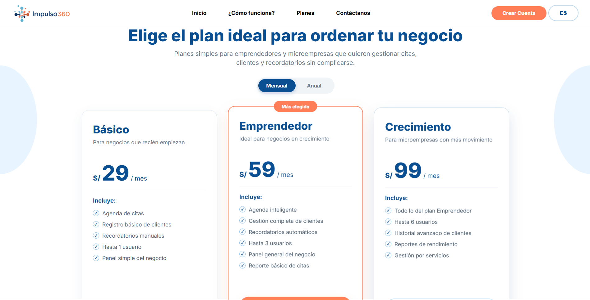

4. Contacto

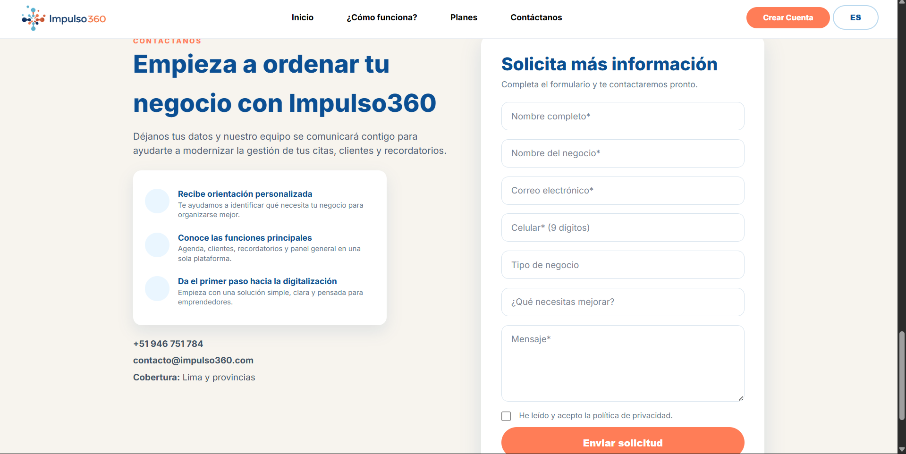

#### 5.2.1.6. Services Documentation Evidence for Sprint Review.

Durante el Sprint 1, no se desarrollaron Web Services ni endpoints documentados con OpenAPI, ya que el alcance principal de este avance estuvo enfocado en la implementación inicial del Landing Page de Impulso360. En esta primera etapa, nuestro equipo trabajó únicamente con HTML, CSS y JavaScript para construir las secciones principales de la página, como inicio, beneficios, planes, contacto y footer.

Por ese motivo, en este avance no se cuenta todavía con documentación OpenAPI, ejemplos de request/response, parámetros de endpoints ni commits relacionados con servicios backend. La documentación de Web Services será desarrollada en los siguientes sprints, cuando se implemente el backend del sistema y se construyan los endpoints relacionados con autenticación, gestión de citas, gestión de clientes, servicios del negocio, perfil digital y recordatorios.

#### 5.2.1.7. Software Deployment Evidence for Sprint Review

El despliegue del sitio web de Impulso360 se realizó mediante GitHub Pages. Esta configuración permite que la landing page sea accesible públicamente desde internet y que se actualice de forma automática cada vez que se realicen cambios en la rama principal del repositorio.

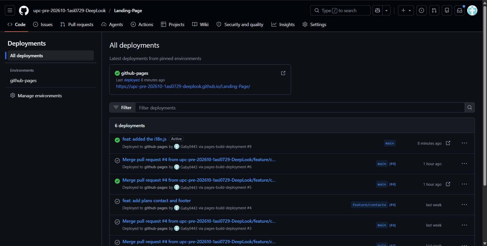

URL: [https://upc-pre-202610-1asi0729-deeplook.github.io/Landing-Page/](https://upc-pre-202610-1asi0729-deeplook.github.io/Landing-Page/)

#### 5.2.1.8. Team Collaboration Insights for Sprint Review

Durante este sprint, el equipo se centró en la documentación e implementación de la landing page del proyecto. El trabajo se organizó mediante el uso de GitHub como herramienta principal para la colaboración y control de versiones. A continuación se presentan las colaboraciones y commits hechos tanto para el landing page como para el reporte.

Report: 

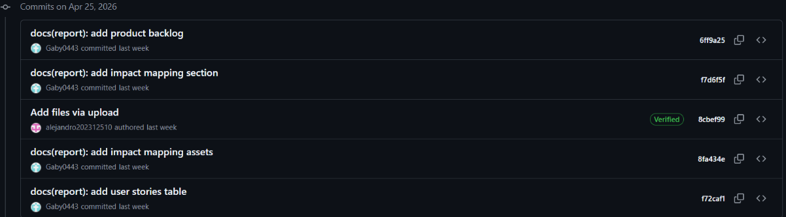

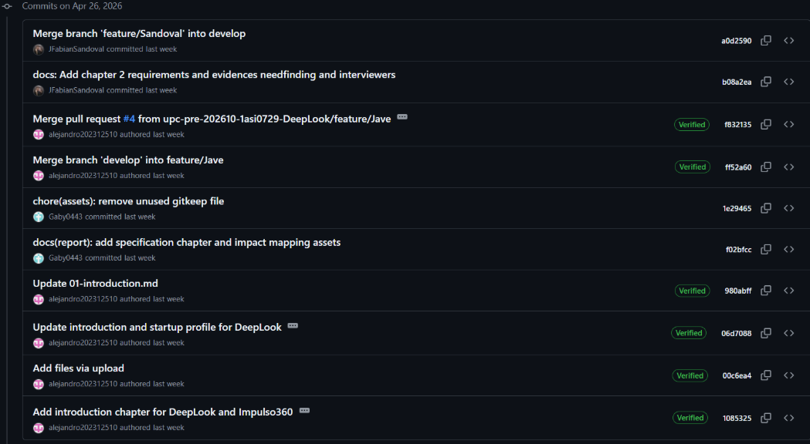

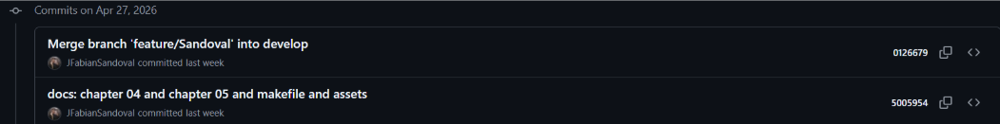

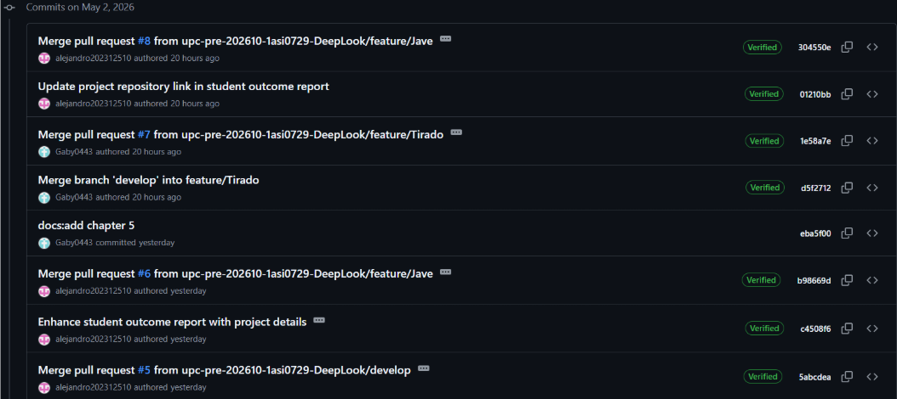

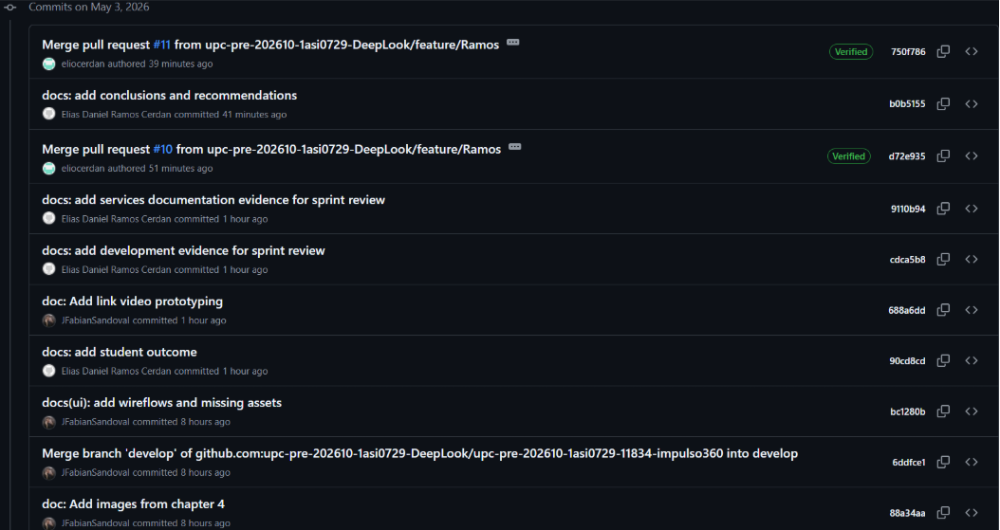

Landing Page:

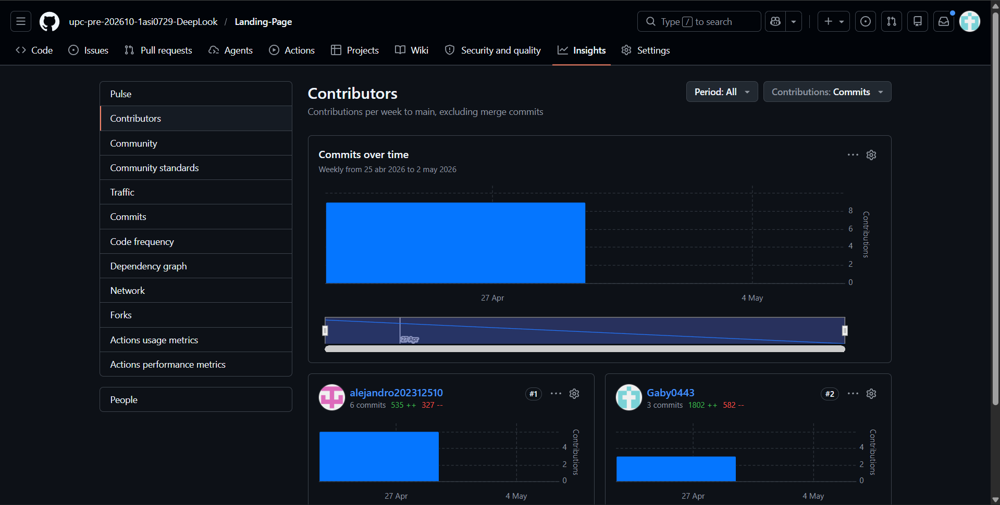
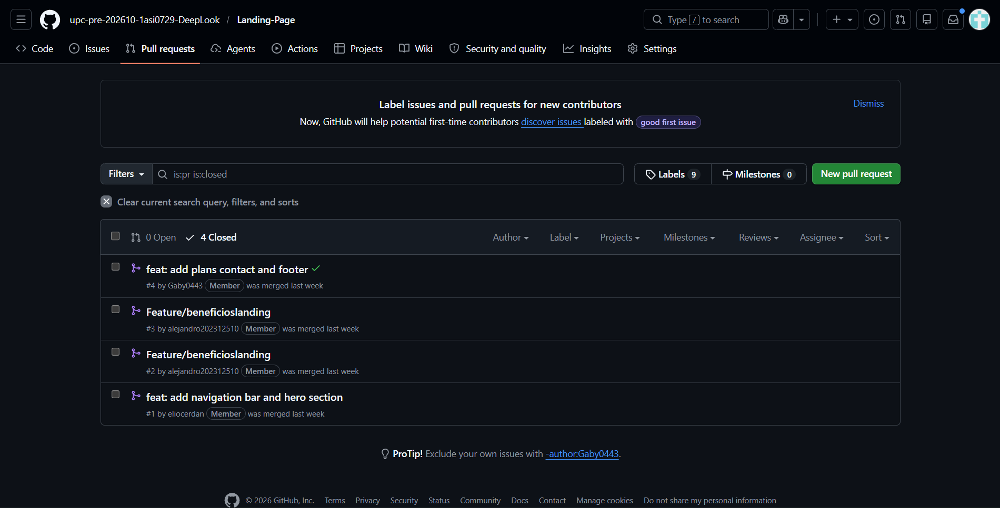
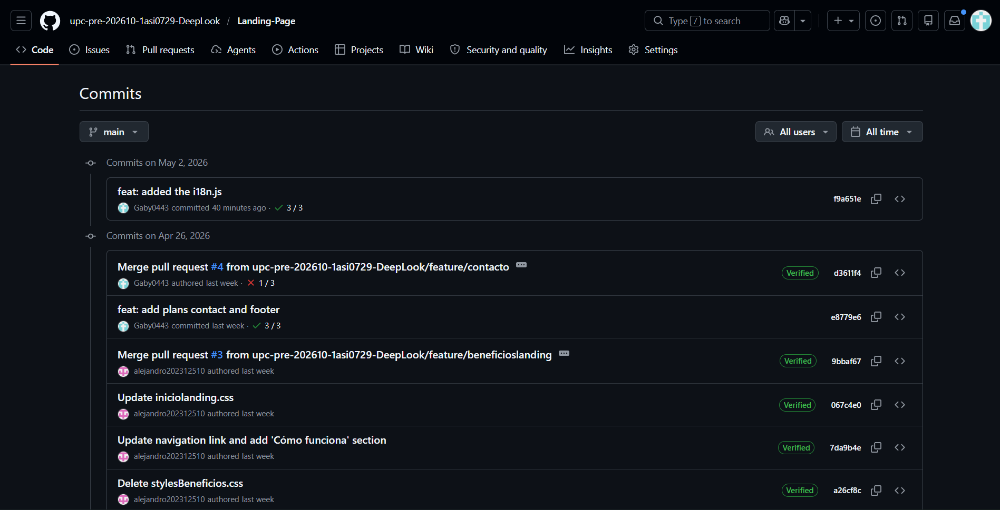
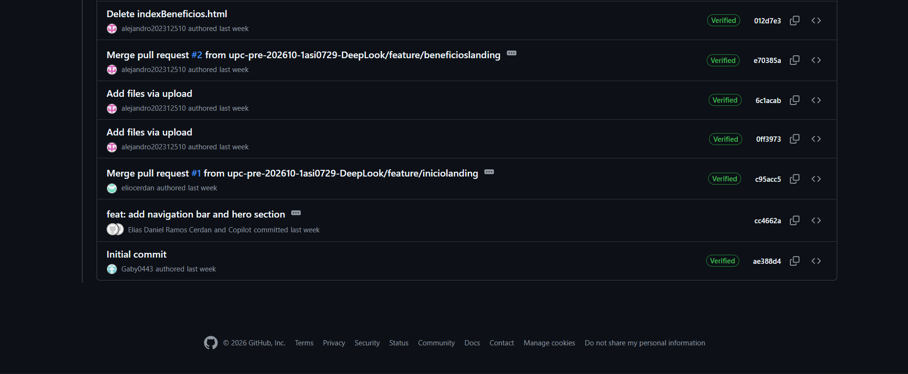

###  5.2.2. Sprint 2
#### 5.2.2.1. Sprint Planning 2.

| Sprint \# | Sprint 2                                                                                                                                                                                                                                                                                                                                       |
| :---- |:-----------------------------------------------------------------------------------------------------------------------------------------------------------------------------------------------------------------------------------------------------------------------------------------------------------------------------------------------|
| **Sprint Planning Background** |                                                                                                                                                                                                                                                                                                                                                |
| Date | 06 \- 05 \- 2026                                                                                                                                                                                                                                                                                                                               |
| Location | Reunión virtual via google meets                                                                                                                                                                                                                                                                                                               |
| Prepared By | Grupo DeepLook                                                                                                                                                                                                                                                                                                                                 |
| Attendees | Merino Ordinola, Winnie Lisbeth  Sandoval Cueto, Fabian Jesus  Jave Chang, Alejandro Manuel  Ramos Cerdan, Elias Daniel  Tirado Carrera, Gabriela Luciana                                                                                                                                                                                      |
| **Sprint Goal & User Stories** |                                                                                                                                                                                                                                                                                                                                                |
| Sprint 1 Goal | Nuestro enfoque es desarrollar el frontend de la aplicación web de Impulso360. Creemos que una interfaz intuitiva y organizada permitirá a los emprendedores gestionar sus citas, clientes y servicios de manera sencilla. Esto se confirmará cuando los usuarios puedan navegar correctamente entre los módulos principales de la plataforma. |
| Sprint 1 Velocity | 35 Story Points                                                                                                                                                                                                                                                                                                                                |
| Sum of Story Points | 35 Story Points                                                                                                                                                                                                                                                                                                                                 |

#### 5.2.2.2. Aspect Leaders and Collaborators.

| Team Member | GitHub Username |Panel General + Ayuda| Agenda | Clientes | Perfil del Negocio + Servicios | Notificaciones |
| :---- | :---- | :---- | :---- |:---------|:-------------------------------|:--------------------------|
| Merino Ordinola, Winnie Lisbeth | winniemerino | C | C | C        | L                              | C                         |
| Sandoval Cueto, Fabian Jesus | JFabianSandoval | C | C | C        | C                              | L                         |
| Jave Chang, Alejandro Manuel | alejandro202312510 | C | L | C        | C                              | C                         |
| Ramos Cerdan, Elias Daniel | eliocerdan | L | C | C        | C                              | C                         |
| Tirado Carrera, Gabriela Luciana | Gaby0443 | C | C | L        | C                              | C                         |

#### 5.2.2.3. Sprint Backlog 2.
<table>
  <thead>
    <tr>
      <th>Sprint #</th>
      <th colspan="7">Sprint 2</th>
    </tr>
    <tr>
      <th colspan="2">User Story</th>
      <th colspan="6">Work-Item / Task</th>
    </tr>
    <tr>
      <th>id</th>
      <th>Title</th>
      <th>id</th>
      <th>Title</th>
      <th>Description</th>
      <th>Estimation<br>(Hours)</th>
      <th>Assigned To</th>
      <th>Status</th>
    </tr>
  </thead>
  <tbody>
    <tr>
      <td rowspan="4">US22</td>
      <td rowspan="4">Panel general del negocio</td>
      <td>T01</td>
      <td>Implementar layout principal del dashboard</td>
      <td>Crear la estructura base del dashboard con sidebar, header superior y contenedor principal.</td>
      <td>3</td>
      <td>Elias Ramos Cerdan</td>
      <td>Done</td>
    </tr>
    <tr>
      <td>T02</td>
      <td>Implementar tarjetas resumen del panel</td>
      <td>Crear las cards de “Citas hoy”, “Confirmadas”, “Pendientes” y “Clientes activos”.</td>
      <td>2</td>
      <td>Elias Ramos Cerdan</td>
      <td>Done</td>
    </tr>
    <tr>
      <td>T03</td>
      <td>Implementar sección “Citas del día”</td>
      <td>Desarrollar listado de citas con estados, acciones rápidas y filtros.</td>
      <td>3</td>
      <td>Elias Ramos Cerdan</td>
      <td>Done</td>
    </tr>
    <tr>
      <td>T04</td>
      <td>Implementar calendario lateral y alerta rápida</td>
      <td>Agregar calendario compacto y card lateral de próxima cita.</td>
      <td>2</td>
      <td>Elias Ramos Cerdan</td>
      <td>Done</td>
    </tr>
    <tr>
      <td rowspan="4">US16</td>
      <td rowspan="4">Soporte Básico</td>
      <td>T05</td>
      <td>Implementar vista principal de ayuda</td>
      <td>Crear interfaz principal de ayuda con diseño dividido y buscador central.</td>
      <td>2</td>
      <td>Elias Ramos Cerdan</td>
      <td>Done</td>
    </tr>
    <tr>
      <td>T06</td>
      <td>Crear módulo de tutorial interactivo</td>
      <td>Implementar checklist/tutorial de onboarding con progreso de usuario.</td>
      <td>2</td>
      <td>Elias Ramos Cerdan</td>
      <td>Done</td>
    </tr>
    <tr>
      <td>T07</td>
      <td>Implementar preguntas frecuentes</td>
      <td>Agregar acordeón de preguntas frecuentes y respuestas rápidas.</td>
      <td>2</td>
      <td>Elias Ramos Cerdan</td>
      <td>Done</td>
    </tr>
    <tr>
      <td>T08</td>
      <td>Crear sección de guías rápidas</td>
      <td>Implementar tarjetas de tutoriales rápidos con categorías e iconos.</td>
      <td>2</td>
      <td>Elias Ramos Cerdan</td>
      <td>Done</td>
    </tr>
    <tr>
      <td rowspan="3">US01</td>
      <td rowspan="3">Visualización digital de citas</td>
      <td>T09</td>
      <td>Implementar vista semanal de agenda</td>
      <td>Crear calendario semanal con distribución horaria de citas.</td>
      <td>4</td>
      <td>Alejandro Jave</td>
      <td>Done</td>
    </tr>
    <tr>
      <td>T10</td>
      <td>Implementar filtros de agenda</td>
      <td>Agregar filtros por estado de cita y vistas diaria, semanal y mensual.</td>
      <td>2</td>
      <td>Alejandro Jave</td>
      <td>Done</td>
    </tr>
    <tr>
      <td>T11</td>
      <td>Implementar panel lateral de citas</td>
      <td>Mostrar detalle diario de citas y próximas citas en sidebar derecho.</td>
      <td>2</td>
      <td>Alejandro Jave</td>
      <td>Done</td>
    </tr>
    <tr>
      <td rowspan="2">US04</td>
      <td rowspan="2">Registro de datos de clientes</td>
      <td>T12</td>
      <td>Implementar tabla principal de clientes</td>
      <td>Crear tabla de clientes con columnas de contacto, citas y estado.</td>
      <td>3</td>
      <td>Gabriela Tirado</td>
      <td>Done</td>
    </tr>
    <tr>
      <td>T13</td>
      <td>Implementar buscador y filtros de clientes</td>
      <td>Agregar búsqueda por nombre o teléfono y botón de filtros.</td>
      <td>2</td>
      <td>Gabriela Tirado</td>
      <td>Done</td>
    </tr>
    <tr>
      <td rowspan="1">US08</td>
      <td rowspan="1">Historial por cliente</td>
      <td>T14</td>
      <td>Implementar panel lateral de historial</td>
      <td>Crear sección lateral con historial detallado de citas por cliente.</td>
      <td>2</td>
      <td>Gabriela Tirado</td>
      <td>Done</td>
    </tr>
    <tr>
      <td rowspan="2">US11</td>
      <td rowspan="2">Perfil digital</td>
      <td>T15</td>
      <td>Implementar vista de perfil del negocio</td>
      <td>Crear formulario editable de datos generales del negocio y portada.</td>
      <td>3</td>
      <td>Winnie Merino</td>
      <td>Done</td>
    </tr>
    <tr>
      <td>T16</td>
      <td>Implementar vista previa del perfil público</td>
      <td>Agregar preview lateral del perfil digital y enlace compartible.</td>
      <td>2</td>
      <td>Winnie Merino</td>
      <td>Done</td>
    </tr>
    <tr>
      <td rowspan="1">US24</td>
      <td rowspan="1">Edición de perfil del negocio</td>
      <td>T17</td>
      <td>Implementar configuración de horarios</td>
      <td>Crear sección editable de horarios de atención semanales.</td>
      <td>2</td>
      <td>Winnie Merino</td>
      <td>Done</td>
    </tr>
    <tr>
      <td rowspan="3">US26</td>
      <td rowspan="3">Registro de servicios</td>
      <td>T18</td>
      <td>Implementar cards de servicios</td>
      <td>Crear listado visual de servicios con categorías, precios y estados.</td>
      <td>3</td>
      <td>Winnie Merino</td>
      <td>Done</td>
    </tr>
    <tr>
      <td>T19</td>
      <td>Implementar servicios destacados</td>
      <td>Agregar lógica visual para destacar servicios y mostrar límite permitido.</td>
      <td>2</td>
      <td>Winnie Merino</td>
      <td>Done</td>
    </tr>
    <tr>
      <td>T20</td>
      <td>Crear modal de nuevo servicio</td>
      <td>Implementar formulario modal para registro y edición de servicios.</td>
      <td>3</td>
      <td>Winnie Merino</td>
      <td>Done</td>
    </tr>
    <tr>
      <td rowspan="3">US03</td>
      <td rowspan="3">Alertas de citas</td>
      <td>T21</td>
      <td>Implementar módulo de notificaciones</td>
      <td>Crear listado principal de notificaciones con estados visuales y acciones rápidas.</td>
      <td>3</td>
      <td>Fabian Sandoval</td>
      <td>Done</td>
    </tr>
    <tr>
      <td>T22</td>
      <td>Implementar resumen diario de alertas</td>
      <td>Agregar panel lateral con resumen de citas confirmadas, pendientes y canceladas.</td>
      <td>2</td>
      <td>Fabian Sandoval</td>
      <td>Done</td>
    </tr>
    <tr>
      <td>T23</td>
      <td>Implementar configuración de alertas</td>
      <td>Crear switches de configuración para alertas y recordatorios automáticos.</td>
      <td>2</td>
      <td>Fabian Sandoval</td>
      <td>Done</td>
    </tr>
    <tr>
      <td rowspan="2">US41</td>
      <td rowspan="2">Internacionalización de la APP</td>
      <td>T24</td>
      <td>Preparar frontend para internacionalización</td>
      <td>Separar textos principales de dashboard, agenda, clientes, servicios y notificaciones.</td>
      <td>2</td>
      <td>Todos</td>
      <td>Done</td>
    </tr>
    <tr>
      <td>T25</td>
      <td>Implementar recursos ES/EN de la aplicación</td>
      <td>Crear archivos de traducción y validar consistencia visual en ambos idiomas.</td>
      <td>3</td>
      <td>Todos</td>
      <td>Done</td>
    </tr>
  </tbody>
</table>

#### 5.2.1.4. Development Evidence for Sprint Review.

Durante el Sprint 2, el equipo avanzó en la implementación del frontend de Impulso360. Se desarrollaron las secciones principales, incluyendo el panel general, agenda, clientes, servicios, perfil, ayuda y notificaciones. Estos avances fueron registrados en GitHub mediante commits realizados en ramas feature, siguiendo GitFlow y Conventional Commits.

| Repository          | Branch | Commit Id | Commit Message | Commited on (Date) |
|---------------------|--------|-----------|----------------|--------------------|
| impulso360-frontend |feature/reminder|d131d40|adds global notification bell and list view|2026-05-14|
| impulso360-frontend | feat/overview|a2bd164|implement panel general or overview webapp|2026-05-14|
| impulso360-frontend |feat/clientes|0613c0f|add whole client bounded context|2026-05-14|
| impulso360-frontend |feat/business-profile|d63cf82|implement domain, infrastructure, application and presentation layers|2026-05-14|
| impulso360-frontend |feat/agenda|d6850b4|implementation of agenda view and appointment form|2026-05-14|
| impulso360-frontend |feat/service|9858a61|implement full services CRUD with persistence|2026-05-14|
#### 5.2.2.5. Execution Evidence for Sprint Review.
Durante la ejecución del Sprint 2 se completaron satisfactoriamente los objetivos planteados para el desarrollo del frontend principal de Impulso360. Se implementaron las secciones clave de la aplicación, consolidando una base funcional e intuitiva para la gestión digital de negocios de servicios.

Las principales secciones desarrolladas son:

- Panel general del negocio
- Ayuda y soporte básico
- Agenda digital
- Gestión de clientes
- Perfil del negocio
- Gestión de servicios
- Notificaciones
#### 5.2.2.6. Services Documentation Evidence for Sprint Review

#### 5.2.2.7. Software Deployment Evidence for Sprint Review

#### 5.2.2.8. Team Collaboration Insights during Sprint